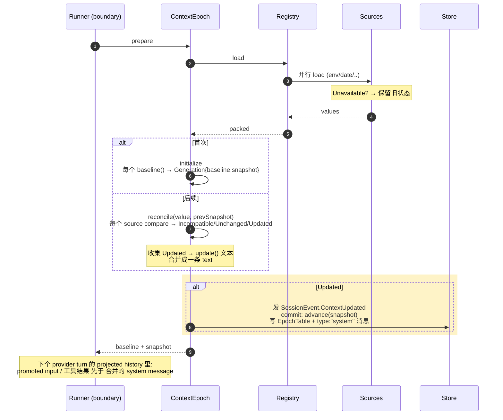

System Context 是给模型的"结构化上下文事实集合"——不是一段静态"系统提示词"，而是一组可观测、可对比、可合并的 **Context Source**。文件在 `packages/core/src/system-context/`。

> 术语严格按 `CONTEXT.md`：用 **System Context**，不用 "system prompt"。详见 [术语表](../glossary#会话与上下文)。

## Context Source 结构

`Source<A>`（`system-context/index.ts:32-39`）：

```ts
interface Source<A> {
  key: Key                           // 命名空间格式 "a/b/c" 的品牌字符串    :22-25
  codec: Codec<A, Json>              // JSON 编解码
  load: Effect<A | Unavailable>      // 不可失败 loader；Unavailable = 暂时观测不到
  baseline(current: A): string       // 首次渲染文本
  update(previous: A, current: A): string   // 变更后的渲染文本
  removed?(previous: A): string      // 可选：源被移除时的渲染文本
}
```

`make<A>()`（`:135-173`）把 `Source<A>` 封成**不透明** `SystemContext`，内部建 `decode`/`encode`/`equivalent`，打包成 `PackedSource`。外部拿不到原始 `A`，只能通过渲染出的文本和 snapshot 打交道。

## Registry

`SystemContextRegistry`（`registry.ts:1-49`）：

- `register(entry)` —— `acquireRelease`，Scope 退出时自动移除
- `load()` —— 读所有 entries，按 key 排序，**并行** `entry.load`，`SystemContext.combine` 组合

Registry 是 **Location 作用域**的——不同 Location 注册不同来源。

## 三个核心操作

### initialize（首次）

`SystemContext.initialize(value)`（`index.ts:198-206`）：

```
observe 所有 sources
  任一 Unavailable → 抛 InitializationBlocked（等所有源就绪）
全部可用 → 每个调 baseline(current)
  → 生成 Generation { baseline: string, snapshot: Snapshot }
```

`Generation.baseline` 就是 **Baseline System Context**——一个 Context Epoch 内不可变的 provider-cache 基线。

### reconcile（后续）

`SystemContext.reconcile(value, previousSnapshot)`（`index.ts:218-226`）：

```
observe 所有 sources，与 previous snapshot 对比:
  每个可用 source: compare(previous.value) →
      Incompatible  → 需要替换 baseline（Context Epoch 切换）
      Unchanged     → 保留旧 snapshot
      Updated       → update(prev, curr) 生成 text
  任何 Incompatible 或 removed source缺 removal rendering → 走 replace
返回:
  { _tag: "Unchanged" }                    无变化
  { _tag: "Updated", text, snapshot }      有变化，产出合并文本 + 新 snapshot
  ReplacementReady                          需要替换 baseline
  ReplacementBlocked                        需要替换但暂不可用，保留旧 baseline
```

### replace（强制重渲）

`SystemContext.replace(value, snapshot)` —— Context Epoch 切换时强制重渲 baseline。

## Context Epoch 与 Snapshot

`SessionContextEpoch`（`packages/core/src/session/context-epoch.ts`）：

```
prepare(value, snapshot):                         context-epoch.ts:40-78
  首次:  SystemContext.initialize(value)          → baseline generation     :51
  后续:  SystemContext.reconcile(value, snapshot) → Updated/Unchanged/...   :60-62
         ReplacementBlocked → 保留旧 baseline                               :63-64
         Updated → 发布 SessionEvent.ContextUpdated                          :72-76
           commit: advance(db, sessionID, result.snapshot)                   :75
```

**Context Epoch** = 一份 baseline 不可变的区间，直到 compaction 完成 / Session 迁移 / 需新基线的上下文切换时结束。

**Context Snapshot** = 模型不可见的 JSON 状态，记录每个 source 上次进 provider turn 的值，用于 `reconcile` 对比。

## Mid-Conversation System Message 的合并产出

多个 Context Source 在同一 **safe boundary** 的变更**合并成一条** Mid-Conversation System Message：

```
safe boundary（provider turn 之间，promote 阶段）
  │
  SessionContextEpoch.prepare
  │  reconcile 对比所有 source
  │  收集所有 Updated source 的 update() 文本
  │  → 合并成一条 text
  ▼
SessionEvent.ContextUpdated（持久化）
  │  投影器写 SessionMessageTable 一条 type:"system" 消息
  ▼
commit: advance(snapshot)   ← snapshot 原子推进
  ▼
下个 provider turn 的 projected history 里，这条 system message 出现在
promoted user input / 已结算工具结果 之后
```

**关键不变量**（来自 `CONTEXT.md`）：

- 上下文变更**惰性地**在 safe boundary 采样接纳，**绝不**在源变化时异步推送
- 多个 source 同 boundary 的变更合并成**一条** Mid-Conversation System Message
- 在 safe boundary，新提升的 user input 或已结算工具结果**先于**合并的 system message
- Context Snapshot 与对应的 Mid-Conversation System Message **原子推进**

## BuiltIns

`system-context/builtins.ts:1-50` 注册两个内置 source：

- `core/environment` —— 工作目录、平台、git 信息
- `core/date` —— 当前日期

插件可注册更多 source（通过 `SystemContextRegistry.register`）。

## Unavailable Context

某 source 暂时观测不到时返回 `Unavailable`：

- `initialize` 时遇到 → 抛 `InitializationBlocked`，等所有源就绪
- `reconcile` 时遇到 → 保留上一次生效的状态，**不发更新**（或首次成功加载前省略它）

这就是 **Unavailable Context** 语义：临时不可用不破坏一致性。

## 整体数据流

```
Context Source (key/codec/load/renderers)
        │
        ▼ register
SystemContextRegistry (Location 作用域)
        │
        ▼ load (并行 observe + combine)
SystemContext (不透明)
        │
        ▼ initialize / reconcile / replace
SessionContextEpoch.prepare (在 safe boundary 调用)
        │
        ├── Baseline System Context (Context Epoch 内不可变)
        ├── Context Snapshot (模型不可见，用于对比)
        └── Mid-Conversation System Message (变更时合并产出，持久化进 history)
```

## 时序图（safe boundary 的参与者视角）



## 相关文档

- safe boundary 与 promote：[session-lifecycle](./session-lifecycle#阶段-5promote提升safe-boundary)
- runner 里调 prepare 的位置：[llm-stream-loop](./llm-stream-loop#2-system-context-baseline)
- 完整术语：[术语表](../glossary#会话与上下文)
