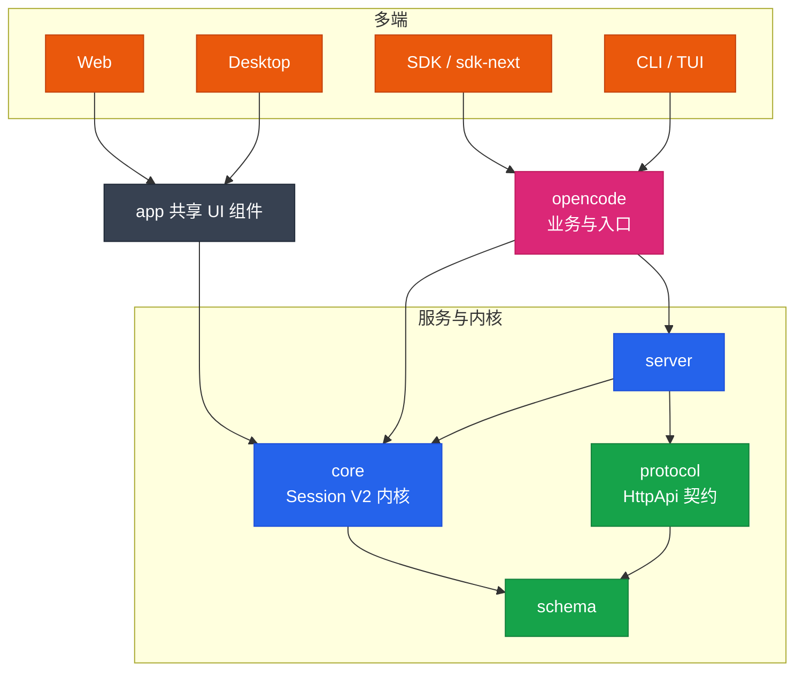

## 一句话定位

**opencode** 是一个开源的 AI 编码 agent（"The open source AI coding agent."），本体是一个 Bun + TypeScript monorepo，对外提供 CLI、TUI、Web、Desktop、SDK 等多种形态。

- 上游仓库：`https://github.com/sst/opencode`（本学习文档基于其 `v1.17.13` 前后的代码）
- 官网：`https://opencode.ai`
- 默认分支：`dev`（本地可能没有 `main` ref，做 diff 用 `dev` 或 `origin/dev`）
- 运行时要求：**Bun 1.3+**

## 技术栈

| 层 | 选型 |
|---|---|
| 语言 / 运行时 | TypeScript 5.8 + Bun 1.3（Node 也兼容，通过 `#db` 条件导入切换） |
| Monorepo | Bun workspaces + Turborepo，`catalog:` 统一版本 |
| 函数式框架 | Effect 4.0 beta（Service / Layer / Schema 贯穿全栈） |
| 数据库 | Drizzle ORM 1.0 rc + SQLite（`@effect/sql-sqlite-bun`） |
| HTTP 服务 | Hono + Effect HttpApi（契约驱动，自动生成 OpenAPI 与客户端） |
| 终端 UI | SolidJS + [opentui](https://github.com/sst/opentui) |
| Web / Desktop UI | SolidJS（`packages/app`），Desktop 用 Electron 包 `packages/app` |
| 文档站 | Mintlify（`packages/docs`，`docs.json`） |
| Lint / 格式化 | oxlint + Prettier（`semi: false`、`printWidth: 120`） |
| 类型检查 | `tsgo`（`@typescript/native-preview`），`bun typecheck` 走 turbo |

## Monorepo 地图

仓库根有 30+ 个 `packages/*`，按职责分层（详细依赖关系见 [架构分层](./architecture)）：

**契约与基础（依赖图最底层）**

- `schema` — 纯类型/契约定义，只依赖 `effect`
- `protocol` — HttpApi 契约，依赖 `schema`
- `llm` — LLM 抽象，依赖 `schema`
- `core` — 共享核心原语 + **Session V2 运行时内核**（依赖 `schema`/`llm`/`plugin`）
- `plugin` — 发布的 `@opencode-ai/plugin` 源（依赖 `sdk`）
- `server` — HTTP 服务器实现（依赖 `core`/`protocol`）

**业务与入口**

- `opencode` — 核心业务逻辑 + CLI/TUI 入口（依赖 `server`/`protocol`/`schema`/`llm`/`plugin`/`sdk`/`tui`）
- `cli` — 独立 CLI 包装
- `tui` / `ui` / `web` / `app` / `desktop` / `session-ui` — 各 UI 表面（SolidJS）
- `enterprise` — 企业版功能（依赖 `core`/`session-ui`/`ui`）

**客户端与 SDK**

- `client` — 从 HttpApi 生成的 Promise/Effect 客户端（仅依赖 `schema`/`protocol`）
- `sdk` — 旧版 JS SDK
- `sdk-next` — 组合 `client`+`core`+`server` 的新一代 SDK

**工具与代码生成**

- `httpapi-codegen` — HttpApi → 客户端代码生成器
- `http-recorder` — HTTP 录制（测试用）
- `script` — 构建/版本脚本
- `function` — GitHub App / 函数后端（`@octokit`、`hono`、`jose`）

**周边（部分非活跃）**

- `containers` / `console` / `stats` / `slack` / `storybook`
- `desktop-electron`、`identity`、`shared` 目前仅占位，非活跃包

## `packages/opencode/src` 子域

opencode 主包的 `src/` 按业务域切分，主要子目录：

| 子目录 | 职责 |
|---|---|
| `cli/cmd/` | CLI 子命令（serve/web/run/tui/session/agent…），最快建立全局感的入口 |
| `cli/cmd/tui/` | TUI，SolidJS + opentui |
| `server/` | HTTP 服务器、路由、HttpApi groups/handlers、SSE/WebSocket |
| `session/` | 会话业务编排（prompt 入口、消息、compaction、retry、revert、tools 编排） |
| `provider/` | LLM provider 注册、认证、模型状态 |
| `tool/` | 工具注册与实现（read/write/edit/shell/grep/glob/lsp/webfetch/mcp/plan/task…） |
| `agent/` | Agent 定义、prompt 模板、子 agent 权限 |
| `permission/` | 权限评估与执行 |
| `config/` | 配置解析（自导出模式 `export * as ConfigX`） |
| `project/` / `worktree/` | 项目 bootstrap、Git worktree |
| `lsp/` / `mcp/` | LSP 客户端、MCP 服务注册 |
| `plugin/` | 插件加载 + 各云 provider OAuth |
| `auth/` | 认证（OAuth 回调、catalog） |
| `storage/` | 持久化（Drizzle schema，`#db` 条件导入） |

> ⚠️ 注意：**Session V2 的运行时内核不在 `packages/opencode/src/session`，而在 `packages/core/src/session*`**。opencode 包的 `session/` 是业务编排层，调用 core 包的内核。这是初学者最容易踩的坑，详见 [架构分层](./architecture)。

## 关键约定速览

- **依赖方向铁律**：Schema → Core/Protocol → Server；Client 只依赖 Schema/Protocol，**绝不**依赖 Core/Server；`sdk-next` 组合三者。详见下一章。
- **默认分支 `dev`**：本地 `main` 可能不存在，diff 一律用 `dev` / `origin/dev`。
- **测试不能在根目录跑**：根 `bun test` 会触发 `do-not-run-tests-from-root` 守卫直接 exit 1；必须 `cd packages/xxx` 后再跑。
- **类型检查用 `tsgo`**：`bun typecheck`（turbo）或包内 `bun typecheck`（`tsgo --noEmit`），**不要**直接用 `tsc`。
- **代码生成物勿手改**：`packages/client/src/generated*` 由 `bun run generate` 生成；改了 Protocol/Server HttpApi 后要重新生成。
- **Drizzle 字段用 snake_case**：这样列名不必再用字符串重定义。
- **风格强约束**（来自 `AGENTS.md`）：禁止别名导入（`import { foo as bar }`）和星号导入；倾向类型推断、避免 `any`；`const` + 三元/早返回优先于 `let`/`else`；Effect 生成器里先把 Service 绑到命名变量再调方法。

## 下一步

进入 [架构分层](./architecture)，看清楚包之间到底怎么连。
