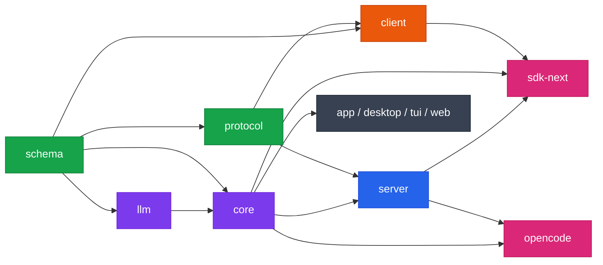
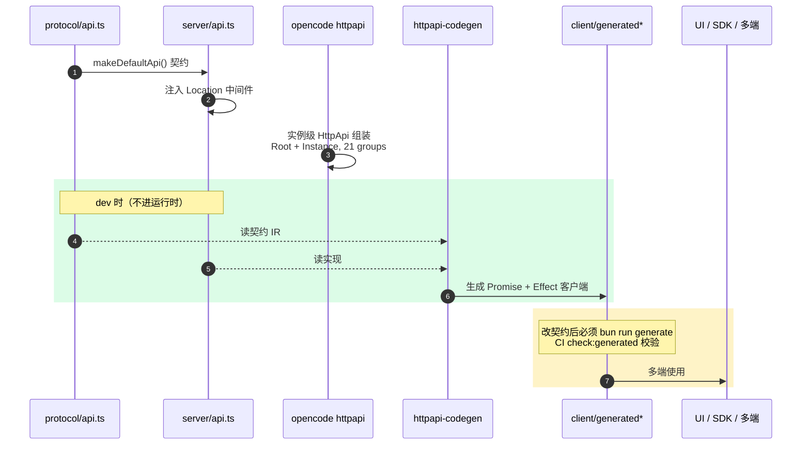

# 02 · 架构分层

理解 opencode 的关键不是某个文件，而是**依赖方向铁律**。把它记住，后面读任何代码都不会跑偏。

## 依赖方向铁律

> 运行时依赖流向：**Schema → Core 和 Protocol → Server**。
> **Client** 运行时代码只能依赖 Schema 和 Protocol，**绝不**依赖 Core 或 Server。
> **`sdk-next`** 组合 Client + Core + Server。

这条规则在 `AGENTS.md` 里是显式约束，目的是让 **客户端可以被独立生成、独立分发**，不把服务器实现拖进来。

## 依赖方向图



> 色阶：🟩 契约层 · 🟪 内核层 · 🟦 服务层 · 🟧 客户端层 · 🩷 组合层 · ⬛ 应用层。关键边：`client` 只从 `schema`/`protocol` 入边（运行时），`sdk-next` 是唯一同时连 `client`+`core`+`server` 的组合点。

## 分层视图

```
┌─────────────────────────────────────────────────────────────┐
│  应用层（UI / CLI）                                          │
│  app · desktop · tui · web · session-ui · cli · enterprise  │
│        ↓ 依赖 core / sdk / server / ui                      │
├─────────────────────────────────────────────────────────────┤
│  组合层                                                      │
│  sdk-next = client + core + server                          │
│  opencode = server + protocol + schema + llm + plugin +     │
│             sdk + tui (dev: core)                           │
├─────────────────────────────────────────────────────────────┤
│  服务层                                                      │
│  server  ──依赖──▶ core · protocol                          │
├─────────────────────────────────────────────────────────────┤
│  内核层                                                      │
│  core    ──依赖──▶ schema · llm · plugin                    │
│  llm     ──依赖──▶ schema                                   │
│  plugin  ──依赖──▶ sdk                                      │
├─────────────────────────────────────────────────────────────┤
│  契约层（依赖图最底）                                        │
│  schema  (仅依赖 effect)                                    │
│  protocol ──依赖──▶ schema                                  │
├─────────────────────────────────────────────────────────────┤
│  工具层（横切，不参与上面的运行时方向）                      │
│  httpapi-codegen · http-recorder · script · function        │
└─────────────────────────────────────────────────────────────┘
```

## 各层职责与依赖（实测）

下面每条都来自对应 `package.json` 的 `dependencies`（devDependencies 另标）。

### 契约层

- **`schema`** — 类型/契约定义，仅依赖 `effect`。整个依赖图的根。
- **`protocol`** — HttpApi 契约。依赖 `schema`。HttpApi 总契约定义在 `packages/protocol/src/api.ts`（`makeDefaultApi`，组合 message/model/provider/session/permission/fs/command/skill/event/agent/health/pty/question/reference/location 等组）。
- **`llm`** — LLM 抽象层。依赖 `schema`（dev: `http-recorder`）。

### 内核层

- **`core`** — 共享核心原语，**也是 Session V2 运行时内核的真正所在地**。依赖 `schema`/`llm`/`plugin`（dev: `http-recorder`）。
- **`plugin`** — 发布的 `@opencode-ai/plugin` 源码。依赖 `sdk`。

### 服务层

- **`server`** — HTTP 服务器实现。依赖 `core`/`protocol`。在 `packages/server/src/api.ts` 引用 protocol 的 `makeDefaultApi`，注入 Location/SessionLocation 中间件。

### 客户端层（关键边界）

- **`client`** — 从 HttpApi 生成的客户端。
  - **运行时依赖**：仅 `schema` + `protocol`。
  - **devDependencies**：`core` / `httpapi-codegen` / `server` —— 仅用于**代码生成**，不进入运行时。
  - 生成产物：`src/generated/`（Promise 客户端）与 `src/generated-effect/`（Effect 客户端）。
  - 生成入口：`packages/client/package.json` 的 `"generate": "bun run script/build.ts"`；校验脚本 `check:generated`。

> 这就是"Client 绝不依赖 Core/Server"的落地方式：core/server 只在 dev 时被 codegen 读取，生成完就不需要了。

### 组合层

- **`sdk-next`** — 组合 `client` + `core` + `server`，提供"嵌入式 opencode"能力（同进程 in-memory HttpClient 走同一套路由与 handler）。
- **`opencode`** — 业务大包。运行时依赖 `llm`/`plugin`/`protocol`/`schema`/`script`/`sdk`/`server`/`tui`（dev: `core`）。

### 应用层

- **`app`** — 共享 Web UI 组件（SolidJS）。依赖 `core`/`sdk`/`session-ui`/`ui`。
- **`desktop`** — Electron 包 `app`。运行时全是 electron 依赖（dev: `app`/`ui`）。
- **`tui`** — 终端 UI。依赖 `core`/`plugin`/`sdk`/`ui`。
- **`session-ui`** — 会话相关共享 UI。依赖 `core`/`sdk`/`ui`。
- **`cli`** — 独立 CLI 包装。依赖 `core`/`sdk`/`server`/`tui`（dev: `script`）。
- **`enterprise`** — 企业版。依赖 `core`/`session-ui`/`ui`。
- **`web`** — dev 依赖 `opencode`。

### 非活跃包

`desktop-electron`、`identity`、`shared` 目前**只有 node_modules，没有 package.json/src**，实质未启用。读代码时可以跳过。

## 三条核心链路

### 1. HttpApi 契约 → 实现 → 客户端生成

```
packages/protocol/src/api.ts        makeDefaultApi()  契约定义
        │
        ├──▶ packages/server/src/api.ts              注入 Location 中间件
        │
        └──▶ packages/opencode/src/server/routes/instance/httpapi/
                  api.ts                             实例级 HttpApi 组合
                  server.ts                          Builder/OpenApi/Router 组装

        生成方向（dev 时）：
        protocol + server ──httpapi-codegen──▶ packages/client/src/generated*
```



改了 Protocol 或 Server 的 HttpApi 之后，**必须**在 `packages/client` 跑 `bun run generate`，否则 `check:generated` CI 会挂。`src/generated` 与 `src/generated-effect` **不要手改**。

### 2. Session V2：内核在 core，编排在 opencode

这是最容易踩的坑：

```
packages/core/src/
  session.ts                 SessionV2 service（prompt 入口）
  session/execution.ts       SessionExecution 接口
  session/execution/local.ts 进程本地实现
  session/run-coordinator.ts SessionRunCoordinator（同 Session resume 合并/唤醒合并）
  session/runner/            SessionRunner 接口与实现（model.ts / llm.ts / to-llm-message.ts …）
  session/store.ts           SessionStore
  location-service-map.ts    LocationServiceMap（drain 时定位 placement）
  system-context/            System Context 代数
    index.ts                 Source/Snapshot/Key 类型
    registry.ts              SystemContextRegistry Service
    builtins.ts              内置源（env/workspace/git…）

packages/opencode/src/session/
  prompt.ts                  opencode 侧 prompt 入口（调用 core 的 SessionV2）
  session.ts                 业务编排
  schema.ts                  会话 schema
```

**记忆要点**：

- core 拥有"**怎么跑一次会话**"（admission、execution、runner、store、system-context）；
- opencode 拥有"**跑什么**"（业务编排、工具实现、provider 注册、消息/compaction/retry 策略）。
- 想理解持久化与并发语义，读 core；想理解业务流程与工具，读 opencode。

Session V2 的运行时规则（admission/execution 分离、每 turn 一次 `llm.stream`、drain 进程本地、`steer`/`queue` 词汇等）见 `AGENTS.md` 的 "V2 Session Core" 段，术语见 [术语表](./glossary.md)。深度拆解留待 `04-session-v2-deep-dive`（待写）。

### 3. 嵌入式 opencode（Embedded OpenCode）

`sdk-next` 组合三者后，可以**同进程**跑 opencode：用 in-memory `HttpClient` 直接打同一套路由与 handler，不经过真实网络。这就是 `CONTEXT.md` 里说的 **Embedded OpenCode**。适合把它当库嵌进别的 TS 应用，而不是起一个独立 server。

## 分层约束怎么落地

约束不是靠自觉，而是靠**依赖方向**自然保证：

- `client` 的 `package.json` 里 `core`/`server` 只在 devDependencies，发布产物不会带它们；
- `protocol`/`schema` 不依赖任何上层；
- 代码生成把"读契约"和"跑实现"在时间上分开——codegen 时读 server，运行时只留 client。

所以当你想"在 client 里直接调 core 的某个函数"时，先停一下——这几乎一定是分层错误。正确做法是把能力下沉到 protocol 契约，再生成到 client。

## 进一步阅读

- 术语与运行时词汇：[术语表](./glossary.md)
- `AGENTS.md`（仓库根）——风格与 V2 Session Core 的权威约束
- `CONTEXT.md`（仓库根）——Session 运行时的规范化词汇表
