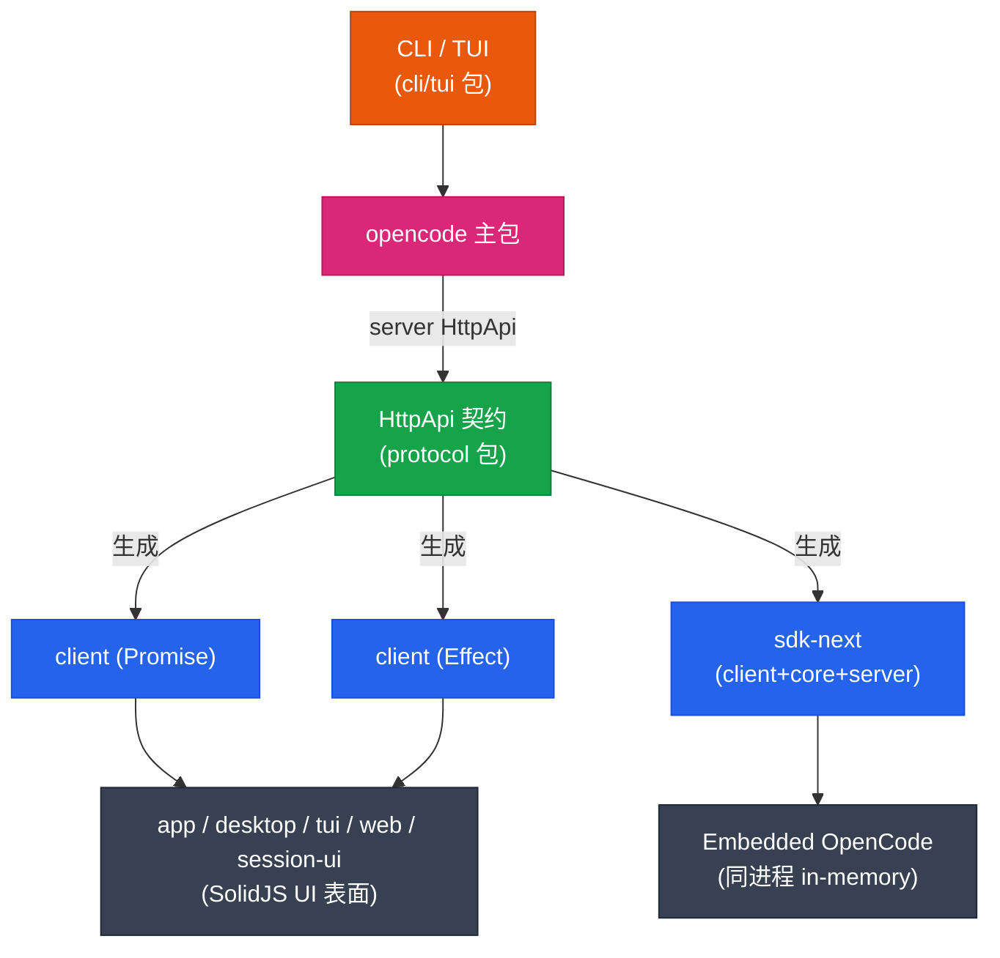

import Tabs from '@theme/Tabs';
import TabItem from '@theme/TabItem';

# 客户端与 UI

opencode 不只是一个 CLI。它有完整的 HTTP 契约、生成的客户端、组合式 SDK，以及 SolidJS 写的多个 UI 表面。这章把它们串起来。

## 全景



## HttpApi：唯一的契约

所有客户端都从同一份契约生成：

- **定义**：`packages/protocol/src/api.ts` 的 `makeDefaultApi()`，组合 14 个 HttpApiGroup（message / model / provider / session / permission / fs / command / skill / event / agent / health / pty / question / reference / location）
- **实现**：`packages/server/src/api.ts` 引用 `makeDefaultApi`，注入 Location/SessionLocation 中间件
- **实例级组合**：`packages/opencode/src/server/routes/instance/httpapi/api.ts` 组装 `RootHttpApi`（Control + ControlPlane + Global）与 `InstanceHttpApi`（Config/File/Instance/MCP/Permission/Project/Provider/Pty/Question/Session/Sync/Tui/Workspace 等 21 个 group）

> 改了契约 → 跑 `packages/client` 的 `bun run generate` → 生成物更新 → 所有客户端自动跟上。这是整个多端体系的根基，详见 [架构分层](./architecture.md) 的"HttpApi 链路"。

## 客户端（`packages/client`）

`client` 包是**生成产物 + 薄封装**，运行时只依赖 `schema` + `protocol`（core/server 仅 devDependencies，给生成器用）。

- `src/generated/` — Promise 风格客户端（`client.ts` / `types.ts` / `client-error.ts`）
- `src/generated-effect/` — Effect 风格客户端
- 入口脚本：`packages/client/package.json` 的 `"generate": "bun run script/build.ts"`

这两个目录的 `.httpapi-codegen.json` 是生成器的元信息。**不要手改**。

## SDK 体系

| 包 | 角色 | 运行时依赖 |
|---|---|---|
| `client` | 从 HttpApi 生成的纯客户端 | `schema` + `protocol` |
| `sdk` | 旧版 JS SDK（`./packages/sdk/js/script/build.ts` 生成） | — |
| `sdk-next` | 新一代 SDK，组合 `client` + `core` + `server` | 三者 |

`sdk-next` 的关键能力是 **Embedded OpenCode**：用 in-memory `HttpClient` 直接打同一套路由与 handler，不经过真实网络。这样能把 opencode 当**库**嵌进任意 TS 应用，而不是起一个独立 server 进程。

- 契约层面，`CONTEXT.md` 把它叫 **OpenCode Client**（生成 API）+ **Embedded OpenCode**（同进程宿主）
- 中间表示叫 **SDK Contract IR**：运行时中性的编译表示，保留编/解码类型投影 + 传输元数据，让不同 SDK emitter 自选公开值模型

### 三种用法对照

同一份 HttpApi 契约，三种接入方式（API surface 均来自生成产物，以下为真实签名）：

<Tabs>
  <TabItem value="promise" label="Promise 客户端" default>
    `@opencode-ai/client`，`make({ baseUrl })` 返回普通对象，方法返回 Promise。
    ```ts
    import { make } from "@opencode-ai/client"

    const client = make({ baseUrl: "http://localhost:4096" })

    const ok = await client.health.get()        // GET /api/health
    const list = await client.sessions.list()   // GET /api/session
    ```
  </TabItem>
  <TabItem value="effect" label="Effect 客户端">
    `@opencode-ai/client/effect`，`OpenCode.make({ baseUrl })` 返回 `Effect`，方法也返回 `Effect`，需提供 `HttpClient` layer。
    ```ts
    import { Effect } from "effect"
    import { FetchHttpClient } from "@effect/platform"
    import { OpenCode } from "@opencode-ai/client/effect"

    const program = Effect.gen(function* () {
      const client = yield* OpenCode.make({ baseUrl: "http://localhost:4096" })
      const ok = yield* client.health.get()
      return ok
    }).pipe(Effect.provide(FetchHttpClient.layer))

    await Effect.runPromise(program)
    ```
  </TabItem>
  <TabItem value="embedded" label="Embedded OpenCode（sdk-next）">
    `@opencode-ai/sdk-next`，`OpenCode.layer` 在同进程内建 in-memory `HttpServer`，用 web handler 直接当 `fetch`，不经真实网络。
    ```ts
    import { Effect } from "effect"
    import { OpenCode } from "@opencode-ai/sdk-next"

    const program = Effect.gen(function* () {
      const oc = yield* OpenCode.Service   // { ...client, tools: { register } }
      const ok = yield* oc.health.get()
      return ok
    }).pipe(Effect.provide(OpenCode.layer))

    await Effect.runPromise(program)
    ```
  </TabItem>
</Tabs>

> 三者用的是**同一套 group/endpoint**（`health`/`sessions`/`messages`/`models`/`providers`/…），区别只在传输层：Promise 走 `globalThis.fetch`，Effect 走 `HttpClient` layer，Embedded 走 in-memory web handler。

## UI 表面（SolidJS）

所有 UI 都用 SolidJS。共享组件在 `packages/app`，各端按需组装。

| 包 | 形态 | 依赖 |
|---|---|---|
| `app` | 共享 Web UI 组件 | `core` / `sdk` / `session-ui` / `ui` |
| `desktop` | Electron 桌面端，包 `app` | 运行时全 electron（dev: `app`/`ui`） |
| `tui` | 终端 UI，SolidJS + [opentui](https://github.com/sst/opentui) | `core` / `plugin` / `sdk` / `ui` |
| `web` | Web 端 | dev 依赖 `opencode` |
| `session-ui` | 会话相关共享 UI | `core` / `sdk` / `ui` |
| `ui` | 基础 UI 原语 | 外部 UI 库 |
| `enterprise` | 企业版功能 | `core` / `session-ui` / `ui` |

### TUI 的特殊性

TUI 不是传统终端库，而是 **SolidJS + opentui**——在终端里跑响应式组件树。入口在 `packages/opencode/src/cli/cmd/tui/`。这是 opencode 最有特色的一块：UI 代码风格和 Web 端一致，但渲染到终端。

### 开发流程

```bash
# 1. 先起无头 server
bun dev serve

# 2. 再起 Web UI（对着 server 调）
bun run --cwd packages/app dev

# 3. 桌面端
bun --cwd packages/desktop dev
```

## 分层边界再强调

写客户端/UI 代码时记住：

- `client`、UI 包**不能**直接 `import` `core` 或 `server` 的运行时代码。需要新能力 → 下沉到 `protocol` 契约 → 生成到 `client` → UI 用。
- UI 包通过 `sdk` / `sdk-next` 拿到客户端实例，不直接碰 server 内部。
- 想同进程嵌入 → 用 `sdk-next` 的 Embedded OpenCode，别自己起 server 再 HTTP 自连。

## 进一步阅读

- 契约与生成链路：[架构分层](./architecture.md#三条核心链路)
- server 端 HttpApi 实现：[运行时子系统](./runtime-subsystems.md) 的 server 段
- 术语：OpenCode Client / Embedded OpenCode / SDK Contract IR / Page → [术语表](./glossary.md)
