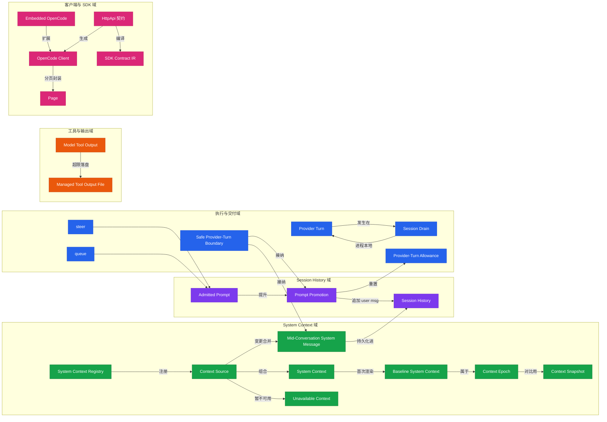

# 06 · 术语表

本表整理自 opencode 仓库根的 `CONTEXT.md`，是该项目的**规范化词汇**。读代码和写文档时请使用左列的规范词，**避免**右列的口语化说法——它们在 opencode 语境里有微妙但重要的差异。

## 会话与上下文

| 规范词 | 含义 | 避免使用 |
|---|---|---|
| **System Context** | 在一次 provider turn 开始时，作为初始指令与按时间顺序的更新呈现给模型的、结构化的上下文事实集合 | system prompt |
| **Session History** | 应用当前 compaction 与 **Context Epoch** 截止后，为某次 provider turn 投影出的按时间顺序的对话 | Session Context |
| **Context Source** | System Context 中一个独立观测的类型化值，由稳定 key、JSON codec、不可失败 loader、纯 baseline/update renderer（及可选 removal renderer）组成 | prompt fragment |
| **System Context Registry** | Location 作用域的、有序且有作用域的生产者注册表，贡献当前 System Context | — |
| **Mid-Conversation System Message** | 一条持久的、按时间顺序的指令，告诉模型某个 Context Source 刚生效的新状态 | system update / system notification / raw text diff |
| **Context Epoch** | 一段区间：在此区间内一份初始渲染的 System Context 作为不可变的 provider-cache 基线，直到 compaction 完成、Session 迁移或需要新基线的上下文切换时结束 | — |
| **Baseline System Context** | 在一个 Context Epoch 开头渲染出的完整 System Context | live system prompt |
| **Context Snapshot** | 模型不可见的、可覆写的 JSON 状态，用于把每个 Context Source 与上次进入 provider turn 的值做对比 | — |
| **Unavailable Context** | 某个 Context Source 值暂时观测不到的预期情况；运行时保留上一次生效的状态并不发更新，或直到首次成功加载前都省略它 | — |

## 提示与执行

| 规范词 | 含义 | 避免使用 |
|---|---|---|
| **Safe Provider-Turn Boundary** | 紧接在一次 provider 调用之前、在持久化 input 提升与必要的工具结算之后的时间点；上下文变更在此按时间顺序被接纳 | — |
| **Admitted Prompt** | 已被接纳进 Session inbox、但尚未进入 Session History 的持久化用户输入 | — |
| **Prompt Promotion** | 持久化迁移：把一条 Admitted Prompt 从待处理 input 移除，把它的 user message 追加进 Session History | — |
| **Provider Turn** | 一次对模型 provider 的请求 + 从该请求投影出的响应 | — |
| **Session Drain** | 一次进程本地执行区间：提升符合条件的 input 并跑必要的 Provider Turn，直到没有立即的续作。**Drain 没有持久身份，也不是 transcript 边界** | — |

## 交付与续作

| 规范词 | 含义 |
|---|---|
| **steer** | 默认交付模式。在当前 drain 仍需续作时，于下一个 Safe Provider-Turn Boundary 提升 |
| **queue** | 显式交付模式。保持 pending，直到 Session 否则将进入 idle 时才提升；提升一条后重新评估续作再提升下一条 |
| **Provider-Turn Allowance** | 提升**任何**新用户输入都会重置所选 agent 的 provider-turn 配额；一批 steer 只重置一次 |

## 工具与输出

| 规范词 | 含义 | 避免使用 |
|---|---|---|
| **Model Tool Output** | Core 执行工具后、持久化进 Session history 并回放给模型的有界投影。工具可语义地塑造该投影，但 Tool Registry 强制最终大小上限 | — |
| **Managed Tool Output File** | 在 opencode 共享 tool-output 目录下创建的临时文件，用来保留因过大而进不了 Session history 的完整输出 | — |
| **Model Request Options** | 从 Catalog 与活跃 Session variant 选出的、provider 语义的模型设置，在 LLM 协议适配器为其编码 provider 请求之前 | Request body / wire options |
| **Generation Controls** | 与 provider 语义解耦的、provider 中立的采样与输出控制；在模型元数据进入 Catalog 时与兼容性 wire 字段分离 | — |
| **Native Continuation Metadata** | 附在 assistant 内容上的、不透明的协议形状数据，用于以兼容模型原生续作该内容（如 reasoning signature、provider 托管 item id） | — |
| **PTY Environment** | server 创建 PTY 时施加的宿主环境 overlay，针对请求 Location 与解析后的 PTY 工作目录观测 | — |

## 客户端与 SDK

| 规范词 | 含义 | 避免使用 |
|---|---|---|
| **OpenCode Client** | 从公开 `HttpApi` 派生的 Promise 与 Effect API；**Embedded OpenCode** 通过 in-memory `HttpClient` 走同一 router/handler 共享 Effect API | remote client |
| **SDK Contract IR** | 权威 `HttpApi` 的运行时中性编译表示，保留编/解码类型投影 + 传输元数据，使各 SDK emitter 可自选公开值模型与运行时解释器 | — |
| **Embedded OpenCode** | 一个有作用域的进程内宿主：结构上扩展 OpenCode Client，提供 in-memory HTTP 传输，并直接暴露额外同进程能力 | local implementation |
| **Page** | 一个有界有序结果，含 `items` 与不透明的 `previous`/`next` 游标链接，支持双向导航同一查询 | response envelope |

## 关键不变量（摘自 `CONTEXT.md` Relationships）

- System Context 是由零或多个 Context Source 组合而成的**不透明载体**。
- Session History 包含投影后的对话消息与已接纳的 Mid-Conversation System Message；当前 Baseline System Context 是**独立的 provider-request 状态**。
- 多个 Context Source 在同一 safe boundary 的变更**合并成一条** Mid-Conversation System Message。
- 上下文变更**惰性地**在 Safe Provider-Turn Boundary 采样与接纳，**绝不**在源变化时异步推送。
- 在 Safe Provider-Turn Boundary，新提升的 user input 或已结算的工具结果**先于**合并的 Mid-Conversation System Message。
- Admitted Prompt 是**可重放**的 pending input，尚未成为模型可见的 Session History。

## 术语交叉引用图

按域分组，箭头表示概念间的派生/组成/时序关系。颜色同全站约定：🟩 System Context 域 · 🟪 Session History 域 · 🟦 执行与交付域 · 🟧 工具与输出域 · 🩷 客户端与 SDK 域。

读图要点：steer/queue 都汇入 Admitted Prompt；Safe Provider-Turn Boundary 是**唯一**同时驱动 Prompt Promotion 与 Mid-Conversation System Message 接纳的时序点；Context Source 的变更不直接进 history，必须经 reconcile 合并成 MCS 才落库。

## 与代码的对应

| 术语 | 主要代码位置 |
|---|---|
| System Context / Context Source / Registry | `packages/core/src/system-context/`（`index.ts`/`registry.ts`/`builtins.ts`） |
| SessionV2（Admitted Prompt 入口） | `packages/core/src/session.ts` |
| SessionExecution / Drain | `packages/core/src/session/execution.ts` + `execution/local.ts` |
| SessionRunCoordinator | `packages/core/src/session/run-coordinator.ts` |
| SessionRunner（Provider Turn） | `packages/core/src/session/runner/` |
| SessionStore | `packages/core/src/session/store.ts` |
| LocationServiceMap（drain 定位） | `packages/core/src/location-service-map.ts` |
| HttpApi 契约 | `packages/protocol/src/api.ts` |
| OpenCode Client（生成） | `packages/client/src/generated*` |

> 想深入这些术语的运行时行为，看 `AGENTS.md` 的 "V2 Session Core" 段与 `CONTEXT.md` 原文。
