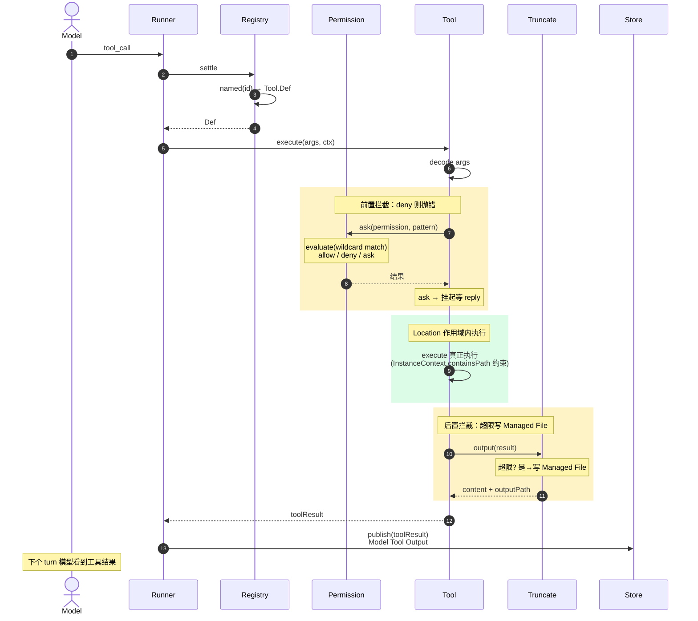

# 工具注册、Location 作用域与权限

工具从定义到被模型调用、受权限约束、输出被截断的全链路。文件主要在 `packages/opencode/src/tool/` 与 `permission/`。

## 工具定义

`Tool.Def`（`tool/tool.ts:63`）：

```ts
interface Def {
  id: string
  description: string
  parameters: Schema        // JSON Schema 描述参数
  execute(args, ctx): Effect<ToolResult>
}
```

`Tool.define()`（`:151`）是定义工厂；`Tool.init()`（`:171`）返回 `Partial<Def>`。

每个具体工具文件（`tool/read.ts`、`tool/shell.ts`…）导出一个 `ToolDef` 常量。

## 注册：ToolRegistry

`ToolRegistry` 服务（`tool/registry.ts:80`，`@opencode/ToolRegistry`）：

```
state 初始化:                                     registry.ts:198-218
  builtin 列表 = [invalid, shell, read, glob, grep, edit, write,
                  task, fetch, todo, search, skill, patch, question, lsp, plan]
  每个 → Tool.init(toolDef) → 包装成带拦截的 Def

插件工具:
  Plugin.ToolDefinition → fromPlugin() → 追加    registry.ts:110
```

### 拦截包装

`Tool.init()` 把 `DefWithoutID` 包成 `Def`，在 `execute` 前后加拦截：

```
execute(args, ctx):
  ├─ decode args（按 parameters Schema）
  ├─ Permission.ask(permission, pattern)   ← 前置权限检查
  ├─ 真正执行原 execute
  └─ Truncate.output(result)               ← 后置截断
```

`ctx` 含 `sessionID` / `messageID` / `permission` / `agent`。

> 内置工具和插件工具走**同一套**拦截，没有特权路径。

## Location 作用域

`SessionRunner`、模型解析、工具注册、权限都是 **Location 级**（`makeLocationNode`）。`SessionStore` 是 **global 级**（`makeGlobalNode`）。

- drain 时 `locations.get(session.location)`（`execution/local.ts:20`）取该 Location 的 Layer，`Effect.provide` 注入
- 工具执行时拿到的 `ctx`、`permission`、文件系统访问都是**该 Location 作用域内**的
- `InstanceContext`（`project/instance-context.ts:6`）`{ directory, worktree, project }` 的 `containsPath()` 判断路径是否在项目边界内——工具不能越界访问

> `Location.workspaceID` 省略 = implicit-local placement；显式 workspace 身份留待未来 placement 语义。

## 权限模型

`Permission` 服务（`permission/index.ts:40`，`@opencode/Permission`）。

### 评估：evaluate

`evaluate(permission, pattern, ...rulesets)`（`index.ts:28`）：

```
遍历所有 rulesets（session ruleset + approved rules）
  对每条 rule:
    Wildcard.match(rule.permission, permission) &&
    Wildcard.match(rule.pattern, pattern)
取 findLast 命中 → 返回 { action: "allow" | "deny" | "ask" }
默认 { action: "allow" }
```

### 请求流程：ask / reply

```
ask(permission, pattern):                          index.ts:67
  result = evaluate(...)
  if result.action == "deny": throw DeniedError
  if result.action == "allow": 通过
  if result.action == "ask":  挂起 pending，等 reply()

reply(id, { action: approve|deny|correct }):       index.ts:109
  approve → 加入 approved rules（后续同 pattern 不再问）
  deny    → 抛 DeniedError
  correct → 让用户修正 pattern
```

`fromConfig()`（`:186`）从 `ConfigPermissionV1.Info` 构建 ruleset。

### Bash arity 判断

shell 工具的权限 pattern 需要匹配命令前缀。`BashArity`（`permission/arity.ts:163`）提供约 130 条常用命令的参数 arity：

```
git: 2          → "git" 后取 2 个 token 作前缀
npm: 2
npm install: 2
npm run: 3      → "npm run" 后取 3 个 token
```

`prefix(tokens)`（`:1`）从命令 token 序列截取匹配 arity 的前缀。这样 `npm run build` 命中 `npm run` 规则而非 `npm` 规则，权限粒度更精确。

### 子 Agent 权限

`deriveSubagentSessionPermission()`（`agent/subagent-permissions.ts:14`）：

- 继承 parent 的 `deny` + `external_directory` 规则
- subagent 无 `task`/`todowrite` 权限 → 自动 deny

## 输出截断

`Truncate` 服务（`tool/truncate.ts:33`，`@opencode/Truncate`）：

```
limits():                                         :42
  读 config tool_output.max_lines/max_bytes
  fallback: MAX_LINES=2000, MAX_BYTES=50*1024     :15-16

output(result):                                   :86-150
  if 超限:
    write 全文 → TRUNCATION_DIR/<ToolID.ascending>  (Managed Tool Output File)
    return { content: 截断预览 + hint, truncated: true, outputPath }
  else:
    return { content, truncated: false }
```

`TRUNCATION_DIR`（`tool/truncation-dir.ts:4`）= `$DATA/tool-output`。`cleanup()`（`:58`）在 session 结束时清理。

## 一次工具调用的完整路径

```
模型返回 tool_call
  → runner: toolMaterialization.settle()                       runner/llm.ts:238
  → ToolRegistry.named(toolName) → Tool.Def
  → Def.execute(args, ctx)
      ├─ decode args
      ├─ Permission.ask(permission, pattern)     ← 拦截：deny 则抛错
      ├─ 执行（Location 作用域内，文件访问受 InstanceContext.containsPath 约束）
      └─ Truncate.output(result)                 ← 拦截：超限写 Managed File
  → publish(LLMEvent.toolResult(...))            ← 作为 Model Tool Output 持久化
  → 回到 continuation 循环，下个 turn 模型看到工具结果
```

## 时序图（一次工具调用的参与者视角）



## 相关文档

- 工具在 runner 中的调用点：[llm-stream-loop](./llm-stream-loop.md#10-工具调用结算)
- 工具功能清单：[tools](../features/tools.md)
- Agent 与子 agent 权限：[agents-and-skills](../features/agents-and-skills.md#子-agent-权限)
- 术语：Model Tool Output / Managed Tool Output File / PTY Environment → [术语表](../glossary.md)
