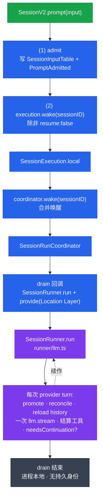

# Session V2 深度

这是 opencode 最核心、也最容易读错的部分。所有路径基于 `packages/core/src`——**Session V2 的内核在 core 包，不在 opencode 包**（opencode 侧只有业务编排与 Layer 组装）。

> 先读 [术语表](./glossary.md) 的"会话与上下文""提示与执行"两节，把 Admitted Prompt / Provider Turn / Session Drain / Context Epoch 这几个词记住。

## 总览：admission 与 execution 分离

Session V2 的根本设计是**把"接纳用户输入"和"执行模型调用"拆成两步**，中间用持久化的事件队列连接。



> 颜色含义：🟩 接纳入口 · 🟦 调度层 · 🟪 执行层 · ⬛ 终止

## 1. SessionV2.prompt —— 接纳入口

文件：`packages/core/src/session.ts:360-386`，整体被 `Effect.uninterruptible` 包裹。

```
(1) result.get(sessionID)                    // 验证 session 存在            :363
(2) resolvePrompt(input.prompt)              // PromptInput → 内部 Prompt    :364
(3) delivery = input.delivery ?? "steer"     // 默认 steer                    :366
(4) SessionInput.admit(db, events, {...})    // 持久化 SessionInputTable     :368
                                              //   + 发布 SessionEvent.PromptAdmitted
(5) SessionInput.equivalent(admitted, expected)  // 一致性校验，否则 PromptConflictError :380
(6) if (input.resume !== false)
        yield* execution.wake(admitted.sessionID)                              :382
```

**`resume: false` 的语义**：只持久化一条 input，**不**触发运行。典型场景：跨进程迁移、批量预写入。默认/`true` 时会唤醒执行。

`admit` 本体在 `packages/core/src/session/input.ts:41-81`：写 `SessionInputTable` + 发 `PromptAdmitted` 事件。

## 2. SessionExecution —— 调度层

接口 `packages/core/src/session/execution.ts:9-18`，四个方法：

- `active` — 当前进程拥有的活跃 session 集合
- `resume(sessionID)` — 显式恢复（idle 启动 / running join）
- `wake(sessionID)` — 注册新工作，可合并
- `interrupt(sessionID)` — 中断

本地实现 `execution/local.ts:10-46`：

```
coordinator = SessionRunCoordinator({
  drain: (sessionID) =>
    store.get(sessionID)                                    // :18  取 session info
      .pipe(Effect.provide(locations.get(session.location)))// :20  注入 Location Layer
      .pipe(SessionRunner.Service.use(runner =>
        runner.run({ sessionID, force })))                  // :22  跑 runner
})
```

**placement 发现**：`locations.get(session.location)` —— 从 `LocationServiceMap`（`packages/core/src/location-service-map.ts`）取该 session 所属 Location 的 Layer，再 `Effect.provide` 注入。这是 drain 时**唯一**查 Location 的地方。

**"No layer should take a Session ID"**：SessionExecution 是唯一知道 sessionID 的调度层，负责把 sessionID 路由到对应 Location。下层（SessionRunner / ToolRegistry 等）通过 Location 的 Layer 依赖注入拿到运行环境，**不**自己接收 sessionID 做 Location 路由。

## 3. SessionRunCoordinator —— 合并与并发

文件：`packages/core/src/session/run-coordinator.ts:1-104`。核心是 `active: Map<Key, Entry<E>>`，每个 key 一个 `Entry`：

```ts
type Entry<E> = {
  done: Deferred
  owner?: Fiber
  pendingWake: boolean
  stopping: boolean
}
```

| 方法 | 行 | 行为 |
|---|---|---|
| `run(key)` | `:67-79` | 已有活跃 entry 且未 stopping → await 其 done（**join**）；否则新建 entry 并 start（force=true） |
| `wake(key)` | `:81-92` | 纯同步。已有 entry → 仅置 `pendingWake=true`（**合并唤醒**）；否则新建 entry 并 start（force=false） |
| `settle(key, entry, exit)` | `:51-65` | 执行完成结算：`pendingWake=true` 且未 stopping → **原地重启同一 entry**（force=false）；否则删 key |
| `interrupt(key)` | `:94-101` | `stopping=true` + `pendingWake=false` + `Fiber.interrupt(owner)` |

**并发设计**：不同 key（不同 session）在 Map 里各自独立 entry → 天然并发。同一 key 的多次 wake 只合并成一次 `pendingWake=true` 的后续 drain。同 session 的 `resume` 不会启新 drain，而是 join 现有执行。

## 4. SessionRunner —— 一次 Provider Turn

入口接口 `runner/index.ts:19-28`：`run({ sessionID, force })`。实现在 `runner/llm.ts:92-407`。

### 双层循环（`run`，`:378-401`）

```
外层 queue 循环:   while (hasPending("queue"))
  内层 continuation 循环: while (needsContinuation)   // 工具调用 / pending steer
    runTurnAttempt(...)
```

- 首轮 `promotion` = steer/queue/undefined，后续轮 = `"steer"`
- `force` 用于无 pending 时也跑一次（resume 场景）

### runTurnAttempt（`:168-343`）

```
(1)  getSession(sessionID)                                    // :174 reload session info
(2)  SessionContextEpoch.initialize / prepare                 // :178/193 取 system context baseline
(3)  if promotion: promoteSteers / promoteNextQueued          // :182-190 safe boundary 提升
       promoted>0 → currentStep = 1                           // :190 重置 provider-turn allowance
(4)  models.resolve(session)                                  // :194 解析 LLM Model
(5)  SessionHistory.entriesForRunner(db, sessionID, baselineSeq) // :195 reload projected history
(6)  toLLMMessages(context, model)                            // :206 翻译为 LLM 消息
(7)  isLastStep = currentStep >= agent.info.steps             // :197
       若 isLastStep: toolChoice="none" + 注入 MAX_STEPS_PROMPT  // :206-209 (max-steps.ts:1-16)
(8)  LLM.request() → llm.stream(request)                      // :200/227 ★ 每 turn 恰好一次
(9)  流式消费: createLLMEventPublisher 持久化每个 event        // :213-225 (publish-llm-event.ts:54)
(10) 工具调用:
       provider-executed → 跳过
       其他 → toolMaterialization.settle() → publish(toolResult)  // :238-266
(11) compactIfNeeded / compactAfterOverflow                   // :210 / :281
(12) awaitToolFibers                                          // :291 等本地工具 fiber
(13) return { needsContinuation, step }                       // :340
```

**关键不变量**：每 provider turn **恰好一次** `llm.stream(request)`。续作前必须 reload projected history。**不要**桥接旧版 `SessionPrompt.loop(...)`，**不要**用内存工具循环（`AGENTS.md` 明令）。

**max-steps**：由 `agent.info?.steps` 配置。达上限后 `toolChoice="none"` + 注入 `MAX_STEPS_PROMPT`（`runner/max-steps.ts:1-16`）强制纯文本收尾。

## 5. Delivery 词汇：steer 与 queue

定义：`packages/schema/src/session-delivery.ts:5` —— `Delivery = Schema.Literals(["steer", "queue"])`，只有两个值。

`Admitted` 结构（`schema/src/session-input.ts:15-23`）：含 `admittedSeq`、可选 `promotedSeq`、`delivery`。`promotedSeq === undefined` = 尚未提升。

| 函数 | 行 | 行为 |
|---|---|---|
| `promoteSteers` | `input.ts:245-266` | 查 `promoted_seq IS NULL AND delivery="steer" AND admitted_seq <= cutoff`，发 `Prompted` 事件，投影器写 `promoted_seq` |
| `promoteNextQueued` | `input.ts:268-288` | 查最早一条 `delivery="queue"` 未提升（`limit 1`），同样发 `Prompted` |

**safe boundary**：promote 发生在 `runTurnAttempt` 开头（`:182-190`），**在** provider call **之前**。`cutoff = EventV2.latestSequence(db, session.id)`（`:183`）——只提升截止到当前已持久化事件序列号的 steer，保证不提升未投影完成的 input。

**配额重置**：`promoted > 0` → `currentStep = 1`（`:190`）。提升**任何**新用户输入都重置 provider-turn allowance；一批 steer 只重置一次。queue 每次只提升一条，提升后重新评估续作再提升下一条。

## 6. System Context —— 上下文代数

目录 `packages/core/src/system-context/`。

### Context Source 结构（`index.ts:32-39`）

```ts
interface Source<A> {
  key: Key                         // 命名空间格式 "a/b/c" 的品牌字符串
  codec: Codec<A, Json>
  load: Effect<A | Unavailable>
  baseline(current: A): string
  update(previous: A, current: A): string
  removed?(previous: A): string
}
```

`make<A>()`（`:135-173`）把 `Source<A>` 封成不透明 `SystemContext`，内部建 `decode/encode/equivalent`，打包成 `PackedSource`。

### Registry（`registry.ts:1-49`）

- `register(entry)` — `acquireRelease`，Scope 退出时移除
- `load()` — 读所有 entries，按 key 排序，并行 `entry.load`，`SystemContext.combine` 组合

### 三个核心操作

| 操作 | 行 | 行为 |
|---|---|---|
| `initialize` | `index.ts:198-206` | observe 所有 sources；有 Unavailable → 抛 `InitializationBlocked`；否则每个 `baseline()` 生成 `Generation { baseline, snapshot }` |
| `reconcile` | `index.ts:218-226` | 与 previous snapshot 对比：`compare()` 返回 Incompatible/Unchanged/Updated；Incompatible 或缺 removal rendering → `replace`；Updated → `update()` 生成 text；返回 `Unchanged` / `Updated { text, snapshot }` / `ReplacementReady` / `ReplacementBlocked` |
| `replace` | — | 强制重渲 baseline（Context Epoch 切换时） |

### Mid-Conversation System Message 合并

在 `SessionContextEpoch.prepare`（`context-epoch.ts:40-78`）：

```
首次:  SystemContext.initialize(value)           → baseline generation        :51
后续:  SystemContext.reconcile(value, snapshot)  → Updated/Unchanged/...     :60-62
       ReplacementBlocked → 保留旧 baseline                                   :63-64
       Updated → 发布 SessionEvent.ContextUpdated                             :72-76
         commit: advance(db, sessionID, result.snapshot)                      :75
```

`ContextUpdated` 事件被投影器写进 `SessionMessageTable`，成为一条 `type: "system"` 的消息，在 **safe boundary**（provider turn 之间的 promote 阶段）插入 projected history。这就是 **Mid-Conversation System Message**——多个 Context Source 在同一 boundary 的变更**合并成一条**。

### BuiltIns（`builtins.ts:1-50`）

内置注册两个 source：`core/environment`（工作目录、平台、git 信息）、`core/date`（当前日期）。

## 7. SessionStore —— 持久化

文件 `packages/core/src/session/store.ts:1-63`。

| 方法 | 行 | 行为 |
|---|---|---|
| `get(sessionID)` | `:35-37` | 读 `SessionTable` 一行 → `SessionSchema.Info` |
| `context(sessionID)` | `:39-41` | `SessionHistory.load` 全量 projected messages |
| `runnerContext(sessionID, baselineSeq)` | `:42-44` | `SessionHistory.loadForRunner`（带 baseline 截止） |
| `message(messageID)` | `:45-57` | 读单条 `SessionMessageTable` |

**持久化的表**：

- `SessionTable` — id / project_id / workspace_id / directory / path / title / agent / model / cost / tokens / time_created/updated / summary / revert / permission / version
- `SessionMessageTable` — id / session_id / seq / type / data
- `SessionInputTable` — id / session_id / admitted_seq / prompt / delivery / promoted_seq / time_created
- `SessionContextEpochTable` — session_id / baseline / snapshot / baseline_seq

**与 Location 的关系**：SessionStore 是 **global 级**（`makeGlobalNode`），数据库对所有 Location 可见。SessionRunner 是 **Location 级**（`makeLocationNode`），通过 `locations.get(session.location)` 拿正确 Layer。Store 不关心 Location，只做数据读写。

## 8. opencode 侧编排

opencode 包负责把 V2 内核组装起来，并提供 V1 兼容路径。

### V2 Layer 组装（`packages/opencode/src/session/session.ts`）

该文件引入了 `SessionExecutionLocal` 和 `SessionV2`（`:13-15`），把 V2 runner 注册到 `LocationServiceMap`，使 core 的 `SessionExecution.wake` 能路由到正确 runner。session.ts 主体是 CRUD（create/get/list/patch/fork/remove/messages/updateMessage）。

### V1 工具循环（`packages/opencode/src/session/prompt.ts`）

⚠️ 这是 **V1** 风格，直接管理 step/tools/processor，**不是** V2 路径：

| 函数 | 行 | 行为 |
|---|---|---|
| `prompt(input)` | `:1052-1071` | 创建 user message → `sessions.touch` → `loop` |
| `loop(input)` | `:1342-1346` | `state.ensureRunning` 包 `runLoop` |
| `runLoop` | `:1082-1340` | while(true)：step++ → 查 finish → 处理 subtask/compaction → `processor.create` + `handle.process` → break/continue |

> `AGENTS.md` 明确：**不要**桥接 `SessionPrompt.loop(...)`，**不要**委托给内存工具循环。新代码走 V2（core 的 `runner/llm.ts`）。读 prompt.ts 主要是为理解旧路径与兼容层。

### compaction / retry / revert

| 文件 | 说明 |
|---|---|
| `session/compaction.ts` | V1 compaction，用 core 的 `SessionCompaction` + `buildPrompt` |
| `session/retry.ts:68-152` | `retryable(error, provider)` 判断可重试；`policy(opts)`（`:176-199`）构建 Effect Schedule，指数退避 |
| `session/revert.ts:38-50` | `revert(input)` 找目标消息 + 创建 revert state；V2 版在 core `session/revert.ts` |

## 不变量清单（改代码前对照）

1. **admission/execution 分离** —— `prompt()` 只 admit + advisory wake，不在 admit 里跑模型
2. **每 turn 一次 `llm.stream`** —— 续作前 reload projected history
3. **drain 进程本地、无持久身份** —— 不跨进程续作（clustering 出现前）
4. **wake 可合并** —— 同 session 多次 wake = 一次后续 drain
5. **promote 只在 safe boundary** —— cutoff = latestSequence，不提升未投影的 input
6. **提升新输入重置 provider-turn allowance** —— 一批 steer 只重置一次
7. **System Context 变更惰性采样** —— 不在源变化时异步推，在 safe boundary 合并成一条 Mid-Conversation System Message
8. **No layer takes a Session ID** —— 只有 SessionExecution 用 sessionID 做 Location 路由

## 进一步阅读

- 术语：[术语表](./glossary.md)
- 分层为何如此：[架构分层](./architecture.md)
- 各子系统业务侧：[运行时子系统](./runtime-subsystems.md)
- 权威约束：仓库根 `AGENTS.md` 的 "V2 Session Core" 段 + `CONTEXT.md`
