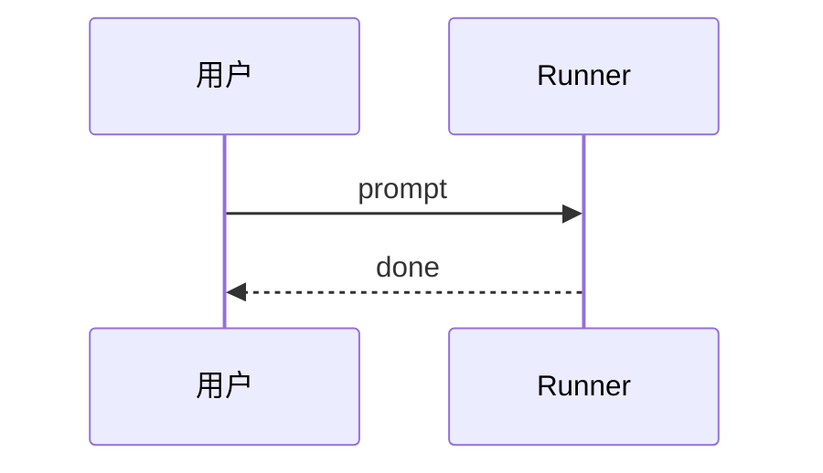

# opencode-docs 文档站

基于 [Docusaurus 3](https://docusaurus.io/) 搭建，用于学习 `opencode` 项目（源码位于相邻的 `../opencode`）。

## 目录约定

```
opencode-docs/
├── docs/          # 文档内容（Markdown/MDX），docusaurus 直接读取
│   ├── intro.md                  # 落地页
│   ├── overview.md               # 项目全景
│   ├── architecture.md           # 架构分层
│   ├── glossary.md               # 术语表
│   ├── tooling.md                # 工程基建
│   ├── runtime-subsystems.md     # 运行时子系统
│   ├── session-v2-deep-dive.md   # Session V2 深度
│   ├── clients-and-ui.md         # 客户端与 UI
│   └── learning-path.md          # 学习路径
└── website/       # Docusaurus 站点工程
    ├── docusaurus.config.ts   # 站点配置；docs.path = "../docs"
    ├── sidebars.ts            # 侧边栏（自动生成）
    └── src/                   # 页面、样式
```

> 关键点：`docusaurus.config.ts` 里 `docs.path` 设为 `../docs`，所以文档内容放在仓库根的
> `docs/`，而不是 `website/docs/`。这样学习文档与站点工程解耦。

## 本地开发

```bash
cd website
pnpm install         # 安装依赖
pnpm start           # 开发服务器，默认 http://localhost:3000
pnpm build           # 生产构建，输出到 website/build
pnpm serve           # 本地预览构建产物
pnpm typecheck       # TS 类型检查
```

## 写新文档

1. 在 `../docs/` 下新建 `*.md` 或 `*.mdx`，文件头加 frontmatter：
   ```markdown
   ---
   title: 标题
   sidebar_position: 3
   ---
   ```
2. `sidebars.ts` 是**手动配置**（非 autogenerated）。新增文档后，把 doc id 加进对应分类的 `items` 数组。doc id = 相对 `docs/` 的路径无扩展名（如 `features/cli-commands`、`internals/session-lifecycle`）。
3. 引用 opencode 源码时用 `file_path:line` 形式，方便读者跳转。

## 搜索

启用 `@easyops-cn/docusaurus-search-local`（v0.54.1，最后一个不含 AI 问答 peer 依赖的干净版本），构建时生成静态索引，无需 Algolia 后端。

- 配置在 `docusaurus.config.ts` 的 `plugins`，`language: ["en", "zh"]` 启用中文分词（lunr）
- `docsDir` 必须设为 `"../docs"`（因为文档不在默认的 `./docs`），否则索引不到
- 顶部导航栏右侧出现搜索框，快捷键 `/` 或点击触发
- 索引覆盖正文、标题、代码块；当前约 630 个文档片段
- **搜索分区**：`searchContextByPaths` 配了两个带标签子上下文——「功能文档」（`docs/features`）与「实现原理」（`docs/internals`）。搜索框旁出现下拉，可缩小范围；`useAllContextsWithNoSearchContext: true` 让默认（不选分区）搜全部，根目录 A 类学习文档始终在全局上下文里

## 标签页（Tabs）

Docusaurus 内置 `<Tabs>`/`<TabItem>`（classic 预设自带，无需插件）。用于"同一目的、多种环境/写法"的并列内容。

在 `.md` 文件顶部加导入（Docusaurus 把 `.md` 当 MDX 解析，可直接用 JSX）：

```mdx
import Tabs from '@theme/Tabs';
import TabItem from '@theme/TabItem';
```

用法（`storage-db.md` 的 Bun/Node `#db` 适配、Drizzle 推荐/避免写法都是范例）：

```mdx
<Tabs>
  <TabItem value="bun" label="Bun 运行时" default>
    解析到 `db.bun.ts`…
  </TabItem>
  <TabItem value="node" label="Node 运行时">
    解析到 `db.node.ts`…
  </TabItem>
</Tabs>
```

> 注意：搜索索引基于 MDX 源码 AST，隐藏 tab 的内容也会被索引。

现有 Tabs 范例：`storage-db.md`（`#db` Bun/Node 适配、Drizzle 推荐/避免）、`tooling.md`（同上）、`clients-and-ui.md`（Promise / Effect / Embedded 三种客户端用法对照，代码为真实生成产物签名）。

## 图表（Mermaid）

站点启用了 `@docusaurus/theme-mermaid`，` ```mermaid ` 代码块会渲染为**可交互图**（缩放、下载 SVG、跟随站点明暗主题）。

- 主题色在 `docusaurus.config.ts` 的 `themeConfig.mermaid` 配置（opencode 绿 `#16a34a`，明暗双主题）
- 支持的图类型：`sequenceDiagram`（时序图）、`graph TD/LR`（流程/依赖图）、`flowchart`、`classDiagram` 等
- 单图自定义可用 `%%{init: {...}}%%` 指令在代码块开头覆盖全局主题
- **按节点类型上色**（`graph`/`flowchart`）：用 `classDef` 定义样式类 + `class 节点A,节点B 类名` 分组。约定色阶（与依赖方向图一致）：🟩 契约层 `#16a34a` · 🟪 内核层 `#7c3aed` · 🟦 服务/客户端层 `#2563eb` · 🟧 入口/多端 `#ea580c` · 🩷 组合层 `#db2777` · ⬛ 终止/UI `#374151`。示例见 `architecture.md`、`overview.md`、`session-v2-deep-dive.md`、`clients-and-ui.md`
- **局部高亮某段消息**（`sequenceDiagram`）：用 `rect rgb(...) ... end` 给一段消息加背景色带。约定两色：🟩 `rgb(220,252,231)` = safe boundary / 正常执行区；🟨 `rgb(254,243,199)` = 关键不变量（★ 每 turn 一次 `llm.stream`、`ContextUpdated` 原子提交、`Permission.ask` 前置拦截、codegen 生成步）。示例见 `internals/` 下 4 篇时序图 + `architecture.md` HttpApi 链路
- **消息编号**（`sequenceDiagram`）：图首加 `autonumber`，每条消息自动编号，方便正文用「第 7 步 = `llm.stream`」引用。全部 5 张时序图已启用
- **术语交叉引用图**（`graph LR`）：`glossary.md` 末尾有一张全术语关系图，按 5 个域分 subgraph + classDef 着色，展示 Context Source / Admitted Prompt / Safe Boundary / HttpApi 等术语的派生与时序关系

示例：

````

````

当前已有 11 张 Mermaid 图：`architecture`（依赖方向图 + HttpApi 链路时序）、`overview`（包关系图）、`clients-and-ui`（全景图）、`session-v2-deep-dive`（admission/execution 流程图）、`glossary`（术语交叉引用图）、`learning-path`（学习路线图）、`internals/` 下 4 篇时序图。时序图全部启用 `autonumber` + `rect` 高亮色带，`graph` 图用 `classDef` 按层着色。

## 后续计划

- A 类学习（9 篇）+ B 类功能（8 篇）+ C 类实现原理（8 篇）= 25 篇已完成
- 已启用：本地搜索（中文 + 分区）· Mermaid 图表（11 张，含 classDef 着色 + rect 高亮 + autonumber 编号 + 学习路线图）· Tabs 标签页（Bun/Node、推荐/避免、客户端三用法 等双轨内容）· 自定义 404 页 + theme-classic CSS 微调
- 按需补图、补术语、或深入某个子系统

