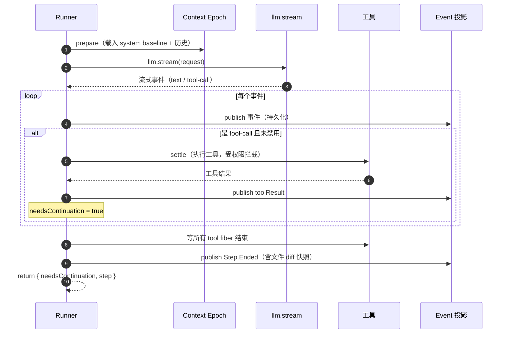

Agent 的心跳是一个循环：**问模型 → 模型要么说话要么调工具 → 执行工具 → 把结果喂回去 → 再问模型**，直到模型不再调工具。opencode 把这个循环做到了生产级——持久化、可中断、可 compaction、防失控。这一篇剥到最小可复刻骨架。

> 源码主文件：`packages/core/src/session/runner/llm.ts`。深度参考见 [一次 Provider Turn 的完整链路](../internals/llm-stream-loop)。

## 最小骨架

抛开持久化和 compaction，一个 agent 循环的本质是两层 `while`：

```ts
// 伪码——提炼自 runner/llm.ts:378-401 的 run()
async function run(sessionID) {
  let promotion = await hasPending(sessionID, "steer") ? "steer"
    : await hasPending(sessionID, "queue") ? "queue" : undefined
  let shouldRun = true
  while (shouldRun) {              // outer：处理排队的新 prompt
    let needsContinuation = true
    let step = 1
    while (needsContinuation) {    // inner：一个 turn 接一个 turn，直到模型不调工具
      const result = await runTurn(sessionID, promotion, step)
      needsContinuation = result.needsContinuation
      step = result.step + 1
      promotion = "steer"          // inner 循环里只接 steer 插队
      if (!needsContinuation)
        needsContinuation = await hasPending(sessionID, "steer")
    }
    shouldRun = await hasPending(sessionID, "queue")  // outer 处理 queue
    promotion = shouldRun ? "queue" : undefined
  }
}
```

- **inner 循环**（`llm.ts:391`）：一个 **Provider Turn** 接一个，`needsContinuation` 为 true 就继续。`needsContinuation` 在 turn 内只要有工具被调用就置 true（`llm.ts:243`）。模型不再调工具 → turn 结束 → `needsContinuation=false` → inner 退出。
- **outer 循环**（`llm.ts:388`）：inner 跑完后，检查有没有排队的新 prompt（`queue`），有就再进 inner。这是「用户在 agent 思考时又发了一条消息」的处理。
- **step**：累计本批 turn 数，用于 agent 步数上限（见下）。

## 一个 Provider Turn 内部：`runTurnAttempt`

`runTurnAttempt`（`llm.ts:168-343`）是单 turn 的全部逻辑。拆成五步：



### 第 1 步：装上下文与工具

```ts
// llm.ts:177-198（精简）
const agent = yield* agents.select(session.agent)
const initialized = yield* SessionContextEpoch.initialize(db, loadSystemContext(agent), session.id)
// ...
const system = initialized ?? (yield* SessionContextEpoch.prepare(db, events, loadSystemContext(agent), session.id))
const model = yield* models.resolve(session)
const entries = yield* SessionHistory.entriesForRunner(db, session.id, system.baselineSeq)
const isLastStep = agent.info?.steps !== undefined && currentStep >= agent.info.steps
const toolMaterialization = isLastStep ? undefined : yield* tools.materialize(agent.info?.permissions)
```

- **agent**：当前会话绑定的 agent 定义（决定 system prompt、工具权限、步数上限）。
- **system context**：首次 `initialize` 建基线+快照，后续 `prepare` 增量对比（详见 [03 · 上下文管理](./03-context-management)）。
- **历史**：`SessionHistory.entriesForRunner` 从 `baselineSeq` 之后的投影历史。
- **工具物化**：`tools.materialize` 按 agent 权限过滤出可用工具。**末步（`isLastStep`）禁用工具**——这是防失控的关键。

### 第 2 步：构造请求

```ts
// llm.ts:200-209
const request = LLM.request({
  model,
  providerOptions: { openai: { promptCacheKey } },
  system: [agent.info?.system, system.baseline]
    .filter((part) => part !== undefined && part.length > 0)
    .map(SystemPart.make),
  messages: [...toLLMMessages(context, model), ...(isLastStep ? [Message.assistant(MAX_STEPS_PROMPT)] : [])],
  tools: toolMaterialization?.definitions ?? [],
  toolChoice: isLastStep ? "none" : undefined,
})
```

- system prompt = `agent.system` + `context.baseline` 两段拼接。
- 末步时 `toolChoice: "none"` 并塞一条「已达最大步数」的 assistant 消息，逼模型收尾。
- `promptCacheKey` 用 session id，复用 provider 的 prompt cache 省钱。

### 第 3 步：流式消费 + 工具 settle

```ts
// llm.ts:227-270（精简）
const providerStream = llm.stream(request).pipe(
  Stream.runForEach((event) =>
    Effect.gen(function* () {
      yield* publish(event)                    // 1) 每个事件先持久化
      if (event.type !== "tool-call" || event.providerExecuted) return
      if (!toolMaterialization) { /* 末步禁工具：失败收尾 */ return }
      needsContinuation = true                 // 2) 有工具调用 → 继续
      const assistantMessageID = yield* publisher.assistantMessageID(event.id)
      const settlement = yield* toolMaterialization.settle({ ... })  // 3) 执行工具（权限拦截在这）
      yield* publish(LLMEvent.toolResult({ ... }), settlement.outputPaths)  // 4) 结果喂回
    }),
  ),
)
```

关键点：

- **每个事件先 publish 再处理**——所以前端能实时看到流式输出，崩了也留有记录。
- **`llm.stream` 每 turn 只调一次**（`llm.ts:227`）。这是 opencode 的硬不变量：一个 Provider Turn = 一次 `llm.stream`。不要在 turn 内部嵌套 stream。
- **工具 settle 是 `Effect.uninterruptible`**（`llm.ts:245`）——工具一旦开始执行就不被中断打断，避免半截写文件。settle 内部会做权限 ask（见 [04 · 工具系统](./04-tool-system)）。
- 工具结果通过 `publish(LLMEvent.toolResult)` 喂回，下一 turn 的历史里就有这条 tool result。

### 第 4 步：收尾与中断处理

stream 结束后（`llm.ts:272-341`）：

- 等所有 tool fiber 结束（`awaitToolFibers`）。
- 捕获 `startSnapshot` → `endSnapshot` 的**文件 diff**，连同 token/finish 一起发 `Step.Ended` 事件。这就是 session 里每步能看到「改了哪些文件」的来源。
- 处理中断：用户按 ESC → `Cause.hasInterrupts` → 清 tool fiber、fail 未决工具、fail assistant。
- 处理 provider 错误与 context overflow（见下）。

### 第 5 步：返回是否继续

```ts
// llm.ts:340
return { needsContinuation: !publisher.hasProviderError() && needsContinuation, step: currentStep }
```

`needsContinuation` = 本次 turn 调过工具 **且** provider 没出错。provider 出错就停（交给上层重试逻辑）。

## 两个防失控机制

### 步数上限

agent 定义里有 `steps`（如 `build` agent 默认无上限，但可配）。`isLastStep`（`llm.ts:197`）命中后：

1. `toolChoice: "none"` + 塞 MAX_STEPS_PROMPT → 模型这 turn 不能调工具，只能用文字收尾。
2. `toolMaterialization = undefined` → 即使模型硬调工具，`llm.ts:239` 会 failUnsettledTools。

这是「agent 跑飞了」的硬刹车。

### Context overflow 恢复

如果模型上下文超了（`isContextOverflowFailure`），且 assistant 还没开口（`llm.ts:232`），opencode 不会直接报错，而是：

1. 触发 `compactAfterOverflow`（compaction 摘要旧历史）。
2. 抛 `TurnTransitionError`（`llm.ts:283`），被 `runTurn` 的 `catchDefect`（`llm.ts:366`）接住。
3. 用摘要后的历史**重启这个 turn**（`runAfterOverflowCompaction`，`llm.ts:350`）。

所以长对话不会因为一次 overflow 直接死掉，会自愈。详见 [03 · 上下文管理](./03-context-management)。

## 自建最小子集

如果你要造一个自己的 coding agent，这个循环最少要做到：

1. **两层循环**：inner 跑到模型不调工具，outer 处理新排队消息。最简版可以省掉 outer（一次只处理一个 prompt）。
2. **每 turn 一次 stream**：别在 turn 内嵌套 stream。工具结果作为 tool message 喂进下一 turn 的历史。
3. **`needsContinuation` 判定**：turn 内有 tool-call 就继续，否则停。
4. **步数上限**：哪怕只是一个硬编码的 max steps，也要有刹车，否则模型可能无限调工具。
5. **事件先持久化**：流式事件边产出边落库，崩了能续。

可以**先不做**的：context epoch 增量（先全量重建 system prompt）、overflow 自愈（先直接报错）、steer/queue（先单 prompt 串行）。这些是生产级要求，最小可用版可以后加。

> 上一节 [导读](./introduction) · 下一节 [02 · 会话状态](./02-session-state)
