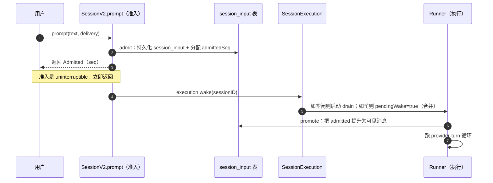

[01](./01-agent-loop) 讲了 agent 循环怎么转。但那个循环跑在内存里——一旦进程崩了，正在排队的用户消息就没了。opencode 的会话状态设计解决的是**可靠性**：消息不丢、可插队、可中断、崩溃可续。核心是三件事：**准入/执行分离**、**序列化 drain**、**steer/queue 投递**。

> 源码：`packages/core/src/session.ts`、`packages/core/src/session/input.ts`、`packages/core/src/session/run-coordinator.ts`。深度参考见 [会话生命周期](../internals/session-lifecycle)。

## 为什么不直接内存 tool loop？

最 naïve 的实现：用户发 prompt → 跑一个 while 循环调 LLM + 工具 → 返回结果。问题：

1. **消息会丢**：进程崩了，没处理完的 prompt 没了。
2. **没法插队**：agent 跑到一半，用户想追加「换个思路」，只能等当前跑完。
3. **没法并发控制**：同一 session 被同时触发两次，状态错乱。
4. **没法恢复**：服务重启后，哪些 prompt 处理到哪了不知道。

opencode 的解法：把「**接收 prompt**」和「**执行 prompt**」拆成两阶段，中间隔一层持久化。

## 准入 / 执行分离



### 准入（admission）

`SessionV2.prompt`（`session.ts:360`）做的第一件事是 `SessionInput.admit`（`input.ts:41`）：

```ts
// input.ts:41-81（精简）
export const admit = Effect.fn("SessionInput.admit")(function* (db, events, input) {
  const existing = yield* find(db, input.id)
  if (existing !== undefined) return existing     // 幂等：同 id 重复提交直接返回
  const timestamp = yield* DateTime.now
  return yield* events.publish(SessionEvent.PromptAdmitted, {
    messageID: input.id, sessionID: input.sessionID, timestamp,
    prompt: input.prompt, delivery: input.delivery,
  }).pipe(Effect.flatMap((event) =>
    Effect.succeed(Admitted.make({
      admittedSeq: event.durable.seq,             // 持久化分配的全局递增序号
      id: input.id, sessionID: input.sessionID,
      prompt: input.prompt, delivery: input.delivery, timeCreated: timestamp,
    }))
  ))
})
```

关键点：

- **幂等**：`find(db, input.id)` 先查，重复提交同 id 直接返回旧记录。客户端重试不会重复准入。
- **事件溯源**：准入靠 `publish(SessionEvent.PromptAdmitted)` 落库，`event.durable.seq` 是数据库分配的持久化序号。事件再被 projector 投影成 `session_input` 行（`projectAdmitted`，`input.ts:83`）。
- **`Effect.uninterruptible`**（外层 `prompt` 包裹）：准入不可中断，保证返回 `Admitted` 收据——**用户发出去的消息一定有回执**。

准入只做「记下来」，不跑 LLM。所以它很快、很稳。

### 执行（execution）

准入完，`session.ts:382` 调 `execution.wake(admitted.sessionID)`——**建议性地**唤醒执行，不阻塞：

```ts
// session.ts:360-383（精简）
prompt: Effect.fn("V2Session.prompt")((input) =>
  Effect.gen(function* () {
    // ... 校验、解析 prompt、决定 delivery
    const admitted = yield* SessionInput.admit(events, db, { ... })
    if (input.resume !== false) yield* execution.wake(admitted.sessionID)
    return admitted
  })
)
```

注意 `if (input.resume !== false)`——准入和唤醒是**解耦**的。你可以只准入不执行（`resume: false`），后面再手动 wake。这是「先攒一批输入，再统一跑」的基础。

`SessionExecution`（`execution.ts`）是个路由层：从 session ID 找到这个 session 所属 Location 的 runner，再委托给 `SessionRunCoordinator`。它本身不持有状态——**任何层都不应接收 Session ID 来定位执行**，placement 只在 drain 时通过 `SessionStore` + `LocationServiceMap` 发现。

## 序列化 drain：`SessionRunCoordinator`

`SessionRunCoordinator`（`run-coordinator.ts:24`）解决并发问题。它是一个**按 key（session ID）串行、跨 key 并发**的协调器：

> 文件头注释（`run-coordinator.ts:5`）：*Serializes execution for each key while allowing different keys to run concurrently.*

每个 session ID 同一时刻**只有一个 drain 在跑**。新工作来了，不是再开一个 drain，而是合并进正在跑的那个。

### 四个操作

```ts
// run-coordinator.ts:6-15
interface Coordinator<Key, E> {
  readonly active: Effect<ReadonlySet<Key>>     // 当前在跑的 key 快照
  readonly run: (key: Key) => Effect<void, E>   // 空闲则启动，忙则 join 当前的
  readonly wake: (key: Key) => Effect<void>     // 记一个合并的 follow-up
  readonly interrupt: (key: Key) => Effect<void>// 停掉当前执行并等清理
}
```

- **`run`**（`:67`）：key 空闲 → 建 entry、启动 drain、`await done`；key 忙 → 直接 `await entry.done`（join 现有 drain，不重复跑）。
- **`wake`**（`:81`）：key 忙 → `entry.pendingWake = true`（打个标记，当前 drain 结束后会再跑一次）；key 空闲 → 启动一个非强制的 drain。
- **`interrupt`**（`:94`）：`entry.stopping = true`、清 `pendingWake`、`Fiber.interrupt(owner)`。
- **`settle`**（`:51`）：drain 结束时的回调。成功且 `pendingWake` → 启动 successor drain（再跑一遍消化新工作）；否则删 entry。

### 为什么这样设计？

- **不丢工作**：`wake` 只是设标记，不实际启动；真正的 successor 在 `settle` 里启动，保证当前 drain 完整结束后才接续。
- **不重复跑**：`run` 在 key 忙时 join 而非新开。
- **可中断**：`interrupt` 设 `stopping`，drain 内部检查后优雅停（fail 未决工具）。
- **进程本地**：drain 没有持久化身份——它只是「进程内一段执行」。集群化之前，drain 是进程本地的。重启后靠「扫未完成的 session_input → wake」恢复。

## steer vs queue：投递词汇

`Delivery = Schema.Literals(["steer", "queue"])`（`packages/schema/src/session-delivery.ts:5`）。用户 prompt 带一个投递模式：

| 模式 | 语义 | 何时提升 | 典型场景 |
|---|---|---|---|
| `steer`（默认） | 紧急转向 | 下一个安全边界前，插入当前 turn | 用户在 agent 思考时追加「换个思路」「停下来」 |
| `queue` | 排队 | 当前批 turn 跑完后，作为新的一批 | 用户连发多条，希望逐条处理 |

### 提升逻辑

在 `runTurnAttempt` 里（`llm.ts:182-191`）：

```ts
if (promotion) {
  const cutoff = yield* EventV2.latestSequence(db, session.id)
  let promoted = 0
  if (promotion === "steer") promoted = yield* SessionInput.promoteSteers(db, events, session.id, cutoff)
  if (promotion === "queue") {
    promoted += Number(yield* SessionInput.promoteNextQueued(db, events, session.id))
    promoted += yield* SessionInput.promoteSteers(db, events, session.id, cutoff)
  }
  if (promoted > 0) currentStep = 1   // 有新输入提升 → step 重置
}
```

- **`promoteSteers`**（`input.ts:245`）：把所有 `admitted_seq <= cutoff` 的 steer 输入提升为可见消息。
- **`promoteNextQueued`**（`input.ts:268`）：只提升**一条** queue 输入（FIFO）。
- **step 重置**：提升新输入后 `currentStep = 1`——新输入算新一批，步数上限重新计。

### Safe Provider-Turn Boundary

steer 不是随便插的——只能在**安全边界**（一个 turn 刚结束、工具都 settle 完、还没开始下一个 turn 的瞬间）提升。`run()` 的 inner 循环每次 `runTurn` 后检查（`llm.ts:396`）：

```ts
if (!needsContinuation) needsContinuation = yield* SessionInput.hasPending(db, input.sessionID, "steer")
```

模型本来要停了，但如果有 steer 在等 → 再跑一个 turn 把 steer 消化掉。这是「用户随时能插话」的实现基础。

> 一个 steer 批次只重置一次 step 配额——防止恶意/bug 用一堆 steer 把步数上限刷穿。

## 数据模型

落库的表（Drizzle，`packages/core/src/session/sql.ts`）：

- **`SessionInputTable`**（`sql.ts:140`）：`id`、`session_id`、`prompt`(JSON)、`delivery`、`admitted_seq`、`promoted_seq`、`time_created`。admitted 但未 promoted 的行就是「待处理 inbox」。
- **`SessionMessageTable`**（`sql.ts:119`）：提升后的可见消息，`(session_id, seq)` 唯一索引——seq 是会话内单调序号。
- **`SessionContextEpochTable`**（`sql.ts:168`）：当前 context 基线与快照（见 [03 · 上下文管理](./03-context-management)）。

准入写 `SessionInputTable`，提升把 input 标 `promoted_seq` 并写 `SessionMessageTable`。崩溃后扫 `promoted_seq IS NULL` 的 input 就能恢复。

## 自建最小子集

可靠性这块，最小可用版：

1. **准入/执行分离**：哪怕只用一张 `pending_prompts` 表，也要把「接收」和「处理」拆开。接收立刻返回 id + 持久化，处理异步。
2. **幂等准入**：用客户端给的 id 去重，重试不重复。
3. **单 session 串行**：同一 session 同时只跑一个 drain（用一个 mutex/锁）。跨 session 并发可后加。
4. **崩溃恢复**：启动时扫未处理的 input，重新触发执行。

可以**先不做**的：steer/queue（先 FIFO 串行处理）、context epoch 持久化（先内存重建）、Location 多目录路由（先单目录）。opencode 的全套是为了多 worktree + 多 session 并发 + 长对话自愈，最小版不需要。

> 上一节 [01 · Agent 循环](./01-agent-loop) · 下一节 [03 · 上下文管理](./03-context-management)
