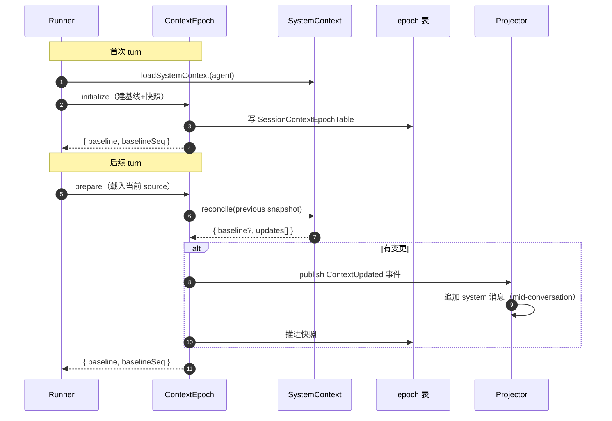

[02](./02-session-state) 解决了消息不丢，但还有个更阴险的问题：**上下文会越来越大**。历史消息越攒越多、system prompt 越拼越长，迟早撞到模型的 context window 上限。而且 system prompt 不是静态的——工作目录、日期、可用 skill 都会变。opencode 用三件套解决：**System Context 代数**（可组合的上下文源）、**Context Epoch**（durable 基线 + 增量快照）、**compaction**（超阈值摘要压缩）。

> 源码：`packages/core/src/system-context/`、`packages/core/src/session/context-epoch.ts`、`packages/core/src/session/compaction.ts`、`packages/core/src/session/runner/llm.ts`。深度参考见 [System Context 代数](../internals/system-context-algebra)。

## 三个问题

naïve 实现里，system prompt 就是一段写死的字符串，历史就是所有消息的数组。问题：

1. **静态 system 不够用**：agent 需要知道当前目录、日期、加载了哪些 skill、有哪些 AGENTS.md 指令——这些会变。
2. **重建成本高**：每次 turn 都把全部 system 源重新拼一遍、重新算 token，浪费。
3. **历史只增不减**：长对话必然 overflow，要么硬截断丢上下文，要么直接报错。

opencode 的解法分别对应：System Context 代数、Context Epoch、compaction。

## System Context 代数

### Context Source：可组合的 typed 源

一个 Context Source 是个带类型的可加载单元（`packages/core/src/system-context/index.ts:32`）：

```ts
// index.ts:32-43（精简）
export interface Source<A> {
  readonly key: SystemContext.Key        // 唯一标识，如 "core/environment"
  readonly codec: Schema.Schema<A>       // 值的 schema（用于 durable 快照）
  readonly load: Effect.Effect<A>        // 怎么取值
  readonly baseline: (value: A) => string  // 怎么渲染成 baseline 文本
  readonly update?: (value: A, previous: A) => string | undefined  // 增量文本
  readonly removed?: (value: A) => string | undefined  // 被移除时的文本
}
```

`SystemContext.make`（`index.ts:135`）把这个 source 闭包成 opaque 的 `SystemContext`。关键设计：

- **typed**：每个 source 有自己的 `Schema`，durable 快照能 round-trip。
- **三段渲染**：`baseline`（首次/全量）、`update`（增量 diff）、`removed`（消失时的告别语）。不是每次都重拼全量——变了才发增量。
- **unavailable 语义**：`load` 可能失败（比如某个 skill 文件被删了），source 能表达「我现在不可用」，而不是崩掉整个 system prompt。

### registry：按 scope 注册

`SystemContextRegistry`（`registry.ts:12`）管理所有 source：

- **`register`**（`registry.ts:25`）：用 `Effect.acquireRelease` 注册，**随 scope 注销**。插件注入的 source 在插件卸载时自动消失。
- **`load`**（`registry.ts:39`）：按 key 排序后**并发**载入所有 source，再 `combine` 成完整 System Context。

### 内置 source

`builtins.ts` 注册基础源：

- **`core/environment`**（`builtins.ts:25`）：工作目录、平台、shell 等。
- **`core/date`**（`builtins.ts:33`）：当前日期——别小看，模型需要知道「今天」来处理相对时间。
- 另有 `core/instructions`（扫 `AGENTS.md`）、`core/skill-guidance`（注入 `<available_skills>` XML，`packages/core/src/skill/guidance.ts:23`）、`core/reference-guidance` 等。

> 设计取舍：**为什么不直接拼字符串？** 因为 source 是 typed + 可组合 + 可增量 + 可 durable 的。拼字符串方案没法做「只发变化部分」的增量，也没法持久化快照做崩溃恢复。

## Context Epoch：durable 基线 + 增量

Context Epoch（`packages/core/src/session/context-epoch.ts`）解决「每次 turn 都重拼 system」的浪费。它给每个 session 维护一个**基线快照**：



三个操作（`context-epoch.ts`）：

- **`initialize`**（`:23`）：首次调用，`SystemContext.initialize`（`index.ts:198`）生成第一代 baseline + 快照，落库。
- **`prepare`**（`:31`）：后续每 turn 调用。载入当前 source → `SystemContext.reconcile`（`index.ts:218`）对比上次快照 → 有变更就发 `ContextUpdated` 事件并推进快照。
- **`reset`**（`:111`）：revert 后调用，删掉 epoch——下个 turn 会重新 `initialize`。

### 为什么这是「mid-conversation system message」的基础

`ContextUpdated` 事件（`packages/schema/src/session-event.ts:101` 定义）被 projector（`projector.ts:377`）投影成一条 **`system` 类型的会话消息**（`message-updater.ts:140`）。

> 这就是 opencode 里「对话进行中 system prompt 变了」的实现：不是改历史，而是**追加一条 system 消息**告诉模型「环境变了」。比如你在对话中途创建了一个 worktree，下个 turn 模型就能从这条 system 消息里知道新目录。

### 增量 reconcile 的价值

`SystemContext.reconcile`（`index.ts:218`）对比 `previous` 快照与当前 source 值：

- 值没变 → 不产出。
- 值变了 → 调 source 的 `update` 渲染增量文本。
- source 消失 → 调 `removed`。

所以绝大多数 turn 里 system 是稳定的，reconcile 产出空——**不重发、不重算 token、不污染历史**。只有真的变了才追加一条消息。

## compaction：超阈值摘要

compaction（`packages/core/src/session/compaction.ts`）解决历史只增不减。当上下文逼近模型上限，它把旧历史**摘要**掉。

### 触发阈值

`compactIfNeeded`（`compaction.ts` 附近）的判定（`:236`）：

```ts
// 精简：估算当前请求的 token，超阈值就压
estimate({ system, messages, tools }) <= context - Math.max(output, buffer)
```

- `context`：模型 context window 大小。
- `output`：模型 max output tokens（要给输出留空间）。
- `buffer`：安全余量。
- `estimate`（`compaction.ts:79`）：`Token.estimate(JSON.stringify(value))`，粗估 token。

`SUMMARY_OUTPUT_TOKENS = 4_096`（`compaction.ts:15`）——摘要本身的输出预算。

### 压缩流程

`compactAfterOverflow`（`compaction.ts:177`）的步骤：

1. 切分历史为 **head**（旧）+ **recent**（保留）。
2. 用 LLM 摘要 head 部分。
3. 发 `Compaction.Started`（`compaction.ts:191`）→ 摘要 → `Compaction.Ended`（`compaction.ts:220`）事件。
4. 摘要后的内容替代 head，recent 原样保留。

> 事件 schema：`Compaction.Started`（`session-event.ts:399`）、`Compaction.Ended`（`session-event.ts:420`）。前端靠这俩事件展示「正在压缩…」。

### overflow 自愈

更关键的是 **overflow 自愈**。当 LLM 返回 context overflow 错误（`isContextOverflowFailure`，`llm.ts:232`），且 assistant 还没开口（`!publisher.hasAssistantStarted()`），opencode 不直接报错：

```ts
// llm.ts:232（精简）
if (isContextOverflowFailure(event) && !publisher.hasAssistantStarted()) {
  // 触发 compaction，然后重启这个 turn
}
```

流程（`llm.ts`）：

1. 检测到 overflow（`:232` / `:280`）。
2. 调 `compactAfterOverflow`（通过 `runTurnAttempt` 的 `compaction.compactAfterOverflow` 参数传入，`:365`）。
3. 抛 `TurnTransitionError`（`llm.ts:153`），被 `runTurn` 的 `catchDefect` 接住。
4. `runAfterOverflowCompaction`（`llm.ts:350`）用摘要后的历史**重启同一个 turn**。

所以长对话不会因为一次 overflow 直接死掉——它会自我压缩然后重试。这是 opencode 能撑超长会话的关键。

## 自建最小子集

上下文管理这块，最小可用版：

1. **静态 system prompt**：先把 system 写死成一段字符串。环境/日期等动态信息手动拼进去。最小版不需要 typed source 代数。
2. **硬截断历史**：历史超了就**保留最近 N 条**，丢掉最旧的。比 compaction 简单得多，代价是丢上下文——但最小可用版可接受。
3. **overflow 直接报错**：先不自愈，让用户手动开新会话。

可以**先不做**的：System Context 代数（先静态拼）、Context Epoch 增量（先每 turn 全量重建 system）、mid-conversation system message（先不允许对话中改环境）、compaction 摘要（先硬截断）。opencode 的全套是为了**长对话 + 动态环境 + 不丢不爆**，最小版用静态 + 硬截断就能跑。

> 但有一个底线：**必须给输出留 token 空间**。`context - max(output, buffer)` 这个减法不能省——否则模型连回复都吐不出来。哪怕最小版，也要在发请求前估算并截断历史。

> 上一节 [02 · 会话状态](./02-session-state) · 下一节 [04 · 工具系统](./04-tool-system)
