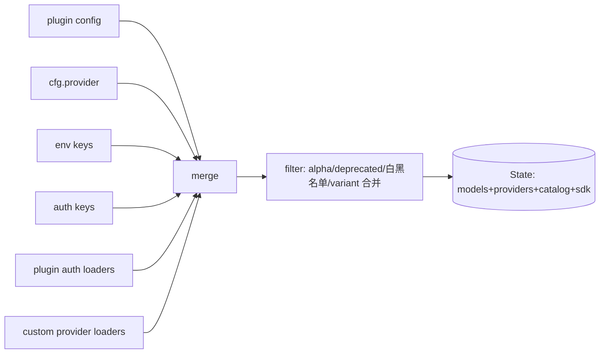

一个能落地的 coding agent 不能绑死在一家模型上——用户要能切 Anthropic/OpenAI/本地模型，要能带各种 auth，要能在厂商 API 差异下保持统一行为。opencode 的 Provider 层把 30+ 厂商抽象成一条统一的 `llm.stream` 契约，runner 只跟这条契约对话，不关心底下是哪家。

> 源码：`packages/opencode/src/provider/provider.ts`、`packages/llm/src/`、`packages/core/src/session/runner/model.ts`。功能概览见 [Providers](../features/providers)。

## 三个问题

naïve 实现里，你直接 `import Anthropic from "@anthropic-ai/sdk"` 然后调 `messages.create`。问题：

1. **厂商差异**：Anthropic 的 messages API、OpenAI 的 responses API、OpenAI-Compatible 的 chat API——请求体、流式事件、工具格式都不一样。
2. **auth 多样**：API key、OAuth token、Azure 资源名、Bedrock 跨区、Vertex ADC……每家不一样。
3. **模型发现**：哪些模型可用？哪个走哪个 route？variant（如 thinking/price tier）怎么合并？

opencode 的解法：**Provider 注册表 + 三合一 state init + route 抽象 + 单 stream 契约**。

## Provider 注册表

`BUNDLED_PROVIDERS`（`packages/opencode/src/provider/provider.ts:107`）是一张「provider id → SDK loader」的表，覆盖 30+ 厂商（anthropic、openai、xai、azure、bedrock、vertex、google、gitlab、cloudflare、snowflake 等）：

```ts
// provider.ts:107（精简）
const BUNDLED_PROVIDERS: Record<string, () => Promise<(opts) => BundledSDK>> = {
  anthropic: () => import("@ai-sdk/anthropic").then(...),
  openai: () => import("@ai-sdk/openai").then(...),
  // ... 30+
}
```

> 用动态 import 按需加载——不至于把 30 家的 SDK 全打进启动包。

## 三合一 state 初始化

Provider state 的初始化（`provider.ts:1313` 的 `InstanceState.make<State>`，state 接口在 `:1142`）是个**多源合并**管线：



合并顺序（`provider.ts:1313-1636`）：

1. **plugin config**：插件声明的 provider。
2. **cfg.provider**：用户 `opencode.json` 里配的。
3. **env keys**：环境变量（`ANTHROPIC_API_KEY` 等）。
4. **auth keys**：`auth.json` 里存的（见下）。
5. **plugin auth loaders**：插件提供的 auth（如 Codex/Copilot 的 OAuth）。
6. **custom provider loaders**（`provider.ts:168-950` 的 `custom()`）：每家厂商的特殊处理——Anthropic headers、Azure 资源名解析、Bedrock 跨区、Vertex ADC、GitLab/Cloudflare/Snowflake 等。

合并后 **filter**：去掉 alpha/deprecated、应用白/黑名单、合并 variant（同一模型的 thinking/标准版归并）。

> 设计取舍：**为什么要这么长的合并管线？** 因为 auth 来源极多——用户可能用 env、可能用配置、可能用插件 OAuth、可能用 `opencode auth login` 存的。opencode 把所有来源都吃进来，filter 后统一成一张 catalog。这让「换 provider」对用户是配置级操作，不是代码级。

## 模型解析：选 route

`SessionRunnerModel.resolve`（`packages/core/src/session/runner/model.ts:188`，standalone helper 在 `:172`）把一个 session 的 `(providerID, modelID)` 解析成具体 route：

- 从 catalog 选 **route 类型**：OpenAI Responses / Anthropic Messages / OpenAI-Compatible Chat。
- apply **variant**（thinking 模式等）。
- 设 **auth header**（从 state 里取对应 provider 的 credential）。

route 决定了请求体怎么拼、流式事件怎么解析。runner 不关心 route——它只拿到一个解析好的 model + credential。

## 单 stream 契约：`llm.stream`

这是 Provider 层最核心的抽象。无论哪家厂商，最终都收敛到一个函数（`packages/llm/src/route/client.ts:396`）：

```ts
// client.ts:396
export function stream(request: LLMRequest): Stream.Stream<LLMEvent, LLMError>
```

- **输入**：统一的 `LLMRequest`（model、system、messages、tools、toolChoice、providerOptions）。
- **输出**：统一的 `Stream<LLMEvent, LLMError>`——一条 `LLMEvent` 事件流。

`compile`（`client.ts:344`）负责把统一 request 翻译成厂商原生 body：cache policy、原生请求体、transport 选择都在这里。

### LLMEvent：统一流式事件

`LLMEvent`（`packages/llm/src/schema/events.ts:209-226` 定义、`:241` 构造器）是 tagged union：

- `text-start` / `text-delta` / `text-end`：文本流。
- `reasoning-start` / `reasoning-delta` / `reasoning-end`：思考链。
- `tool-input-start` / `tool-input-delta` / `tool-input-end`：工具调用参数流。
- `tool-call`：工具调用完整事件。
- `tool-result` / `tool-error`：工具结果。
- `step-finish` / `finish`：步/流结束。
- `provider-error`：厂商错误。

> 这就是 [01 · Agent 循环](./01-agent-loop) 里 `runTurnAttempt` 消费的那条流。runner 只认 `LLMEvent`，不认厂商原生事件——**厂商差异被 compile + stream 这层吸收了**。这是「换 provider 不改 runner」的关键。

### 单 turn 单 stream

呼应 [01](./01-agent-loop)：一个 Provider Turn = 一次 `llm.stream`。不要在 turn 内嵌套 stream。工具结果作为 tool message 喂进下一 turn 的 `messages`，再开一次 stream。

## SSE 超时保护

厂商流式 API 会卡（网络抖动、模型 hang）。opencode 有两层超时（`provider.ts`）：

- **header timeout**（`provider.ts:85` 的 `timeoutController`）：等首字节超时，默认 `OPENAI_HEADER_TIMEOUT_DEFAULT = 10_000`（`:35`）。
- **chunk timeout / SSE read timeout**（`provider.ts:37` 的 `wrapSSE`）：流开始后，两个 chunk 之间超时——`setTimeout` 到了就 abort，报 `"SSE read timed out"`。

这两层在 `resolveSDK`（`provider.ts:1704-1733`）里组合成 `AbortSignal.timeout` + `wrapSSE(res, chunkTimeout, ...)`。Effect 层把 `Cause.isTimeoutError`（`packages/llm/src/route/executor.ts:324`）转成 `LLMError` 的 `Timeout` kind。

> 没有 chunk timeout 的话，模型 hang 住会让整个 session 卡死——这对长跑的 agent 是致命的。

## 结构化输出：`generateObject`

除了自由文本 stream，opencode 还提供结构化输出（`packages/llm/src/llm.ts:164` 的 `generateObject`，内部 `runGenerateObject` 在 `:110`）：

- 输入一个 Schema，让模型产出符合 schema 的对象。
- 用于 agent 生成（`generate` 产出 `{identifier, whenToUse, systemPrompt}`）、title/summary agent 等。
- 不是新 stream——它复用 provider 抽象，只是约束输出格式。

## 自建最小子集

Provider 层这块，最小可用版：

1. **单家先跑通**：先只接一家（如 Anthropic 或 OpenAI），直接用官方 SDK。别一上来就抽象 30 家。
2. **统一 stream 事件**：哪怕只有一家，也把 SDK 的流式事件转成你自己的统一 event 类型（text-delta / tool-call / finish）。这样以后加第二家时 runner 不用改。
3. **auth 从 env 开始**：先只支持 `XXX_API_KEY` 环境变量。OAuth/auth.json 后加。
4. **超时**：至少加一个 stream 超时，别让 hang 拖死 session。

可以**先不做**的：30 家注册表（先 1 家）、auth catalog 多源合并（先 env）、variant 合并（先不支持）、route 多类型（先硬编码一种）、结构化输出（先让模型返回文本自己 parse）。opencode 的全套是为了「任意厂商即插即用」，最小版单家能跑就行。

> 但有一条底线：**统一事件流抽象**。哪怕只有一家，也别让 runner 直接吃 SDK 原生事件。否则加第二家时要重写 runner——这是最容易踩的坑。

> 上一节 [04 · 工具系统](./04-tool-system) · 下一节 [06 · MCP 与 Skill](./06-mcp-skills)
