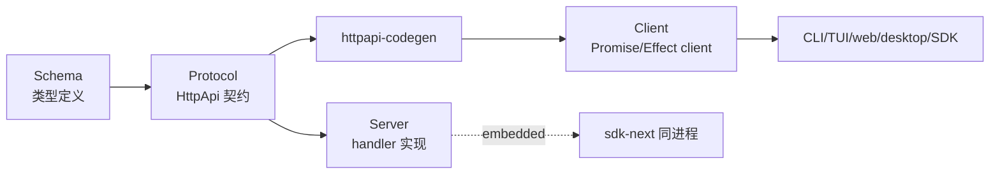

opencode 不只是个 CLI——它同时是 CLI、TUI、web 应用、桌面应用、SDK、可嵌入式库。这么多端怎么共享同一套后端能力？答案是**契约驱动**：定义一份类型化的 HTTP API 契约，server 实现它，各端用 codegen 出来的 client 调它。一个端改了，契约保证其他端不破。

> 源码：`packages/protocol/`、`packages/server/`、`packages/httpapi-codegen/`、`packages/client/`、`packages/sdk-next/`。深度参考见 [HttpApi 与 codegen](../internals/httpapi-codegen) 与 [客户端与 UI](../clients-and-ui)。

## 三层依赖



依赖方向是铁律（见 [架构](../architecture)）：Schema → Protocol → Server；Client 只依赖 Schema/Protocol，**绝不**依赖 Server。

## Protocol：类型化契约

`packages/protocol/src/api.ts` 的 `makeApi`（`:66`）装配 18 个 group。每个 group 是一个 `HttpApiGroup`，每个端点用 `HttpApiEndpoint` 声明：请求/响应 schema、路径、方法。

### 中间件以 key 形式声明

关键设计（`api.ts:25` 注释）：**Protocol 拥有中间件位置，Server 注入具体 key**。Protocol 声明「这个端点需要 location、authorization、schemaError、auth 中间件」，但不实现它们——Server 层注入具体实现。这样 Protocol 保持纯类型，不耦合具体服务。

### SSE 事件流

事件订阅是 SSE 端点（`packages/protocol/src/groups/event.ts:35`）：

```ts
HttpApiEndpoint.get("event.subscribe", "/api/event", {
  success: HttpApiSchema.StreamSse({ data: EventSchema }),
  ...
})
```

返回类型是 `StreamSse`——契约里就声明了这是流式。client codegen 会把它变成 `AsyncIterable<Event>`。

### WebSocket PTY + ticket

PTY（终端）需要双向流，用 WebSocket（`packages/protocol/src/groups/pty.ts:21` 的 `PtyGroup`）。但 WebSocket 不走标准 HTTP 中间件——`hasPtyConnectTicketURL`（`pty.ts:17`）实现 **ticket bypass**：先通过 HTTP 拿一次性 ticket，再用 ticket 连 WebSocket，绕过 Authorization header（`:15` 注释）。

## Server：handler + 中间件实现

`packages/server/src/routes.ts`：

- **`createRoutes(password)`**（`:39`）：完整 server，带 Basic auth 中间件。
- **`createEmbeddedRoutes()`**（`:47`）：嵌入式版，**无 auth**——给 sdk-next 同进程用。
- 都经 `HttpApiBuilder.layer(Api, { openapiPath: "/openapi.json" })`（`:54`）装配。

### location 中间件

`packages/server/src/location.ts:11` 的 `LocationMiddleware` 是核心——它从请求 header 解析当前操作的位置：

- `x-opencode-directory`（`location.ts:33`）：工作目录。
- `x-opencode-workspace`（`:31`）：workspace id。

每个请求都带这俩 header，middleware 解析成 `Location.Ref`，per-request 提供 `LocationServiceMap`（`location.ts:52`）。

> 这就是 opencode「一个 server 同时管多个 project/worktree」的基础：**不是 server 启动时绑定目录，而是每个请求带目录 header**。client（CLI/TUI）发请求时把自己当前的目录塞进 header。

### OpenAPI + legacy 兼容

`OpenApi.fromApi(PublicApi)`（`packages/opencode/src/server/server.ts:68`）从契约生成 OpenAPI spec。`PublicApi`（`packages/opencode/src/server/routes/instance/httpapi/public.ts:530`）带 `matchLegacyOpenApi` transform（`public.ts:82`）——兼容旧 SDK 的字段命名。

## codegen：契约 → client

`packages/httpapi-codegen/src/index.ts` 是 codegen 引擎：

- **`compile`**（`:76`）：reflect HttpApi → 内部 Contract 表示。
- **`emitPromise`**（`:238`）：生成 Promise-based client（fetch + SSE AsyncIterable）。
- **`emitEffect`**（`:215`）/ **`emitEffectImported`**（`:225`）：生成 Effect-based client。
- **`write`**（`:710`）：管理 `.httpapi-codegen.json` manifest + prettier 格式化。

### Client contract

`packages/client/src/contract.ts` 定义 `ClientApi`（`:14`）——codegen 的输入配置：

- `groupNames`（`:19`）：要生成哪些 group。
- `endpointNames`（`:40`）：端点命名。
- `omitEndpoints`（`:53`）：**省略 raw 路由**——`fs.read`、`pty.connect`、`pty.connectToken` 不生成 Promise client（它们是流式/原始路由，不适合 Promise 模型）。

> 设计取舍：**为什么 omit 某些端点？** 因为 Promise client 表达不了双向流。PTY/原始文件流走单独的 client 路径。契约里声明 omit，避免生成出难用的 Promise 包装。

## 三种 client 形态

### 1. generated Promise/Effect client（`packages/client`）

`script/build.ts` 跑 codegen，产出 `src/generated`（Promise）+ `src/generated-effect`（Effect）。这是「标准 client」——通过 HTTP 调远端 opencode server。

### 2. legacy JS SDK（`packages/sdk/js/src/v2`）

- `createOpencodeClient`（`client.ts:50`）：包 `@hey-api/openapi-ts`，自动加 `x-opencode-directory` header + 错误包装。
- `createOpencodeServer`（`server.ts:22`）：**spawn `opencode serve` 子进程**——SDK 自己起一个 server，用户不用手动管。

### 3. sdk-next embedded（`packages/sdk-next`）

最特别的形态——**同进程内嵌**（`packages/sdk-next/src/opencode.ts`）：

```ts
// opencode.ts:22-35（精简）
const handler = HttpRouter.toWebHandler(createEmbeddedRoutes().pipe(...))
const fetch = (req) => handler(req)   // 自定义 fetch 闭包，不走真网络
const opencode = yield* OpenCode.make({ baseUrl: "http://opencode.local" })
```

- `createEmbeddedRoutes()` 出无 auth 的路由。
- `HttpRouter.toWebHandler` 转成 web handler。
- 自定义 `fetch` 闭包直接调 handler——**没有真 HTTP，没有 socket**，但走完整的 HTTP 语义。
- `OpenCode.make({ baseUrl: "http://opencode.local" })`（`:35`）用这个 fetch 构造 client。
- 还能 `tools.register`（`:41`）注册自定义工具。

> 这是「把 opencode 当库嵌入」的形态——同一进程里既跑业务又跑 opencode，client 调 server 走内存 fetch。适合把 opencode 集成进别的应用（见 [embedded-opencode](../internals/embedded-opencode)）。

## 多端 UI

各端共享 `packages/app`（SolidJS，15+ context provider）。`packages/desktop`（Electron sidecar spawn）、`packages/tui`（opentui）、`packages/ui`/`session-ui`（Kobalte 组件）都基于它。它们都用 generated client 调 server（或 embedded）。

## 自建最小子集

契约驱动多端这块，最小可用版——**先不做**。理由：

1. **先单端**：你的 agent 先做成 CLI 或单进程库。HTTP server + 多端是产品化阶段的事。
2. **直接函数调用**：最小版「client」就是直接 import server 的函数，进程内调用。不需要 HTTP、不需要 codegen。
3. **要远程时再加 HTTP**：当真需要 CLI 进程 + TUI 进程分离、或要 web UI 时，才把 server 包成 HTTP。这时再考虑契约。

可以**最后再做**的：类型化 HttpApi 契约、codegen、OpenAPI、SSE/WebSocket、location 中间件、embedded sdk。opencode 的全套是为了「一份契约支撑 6+ 端」，最小版单端进程内调用就够了。

> 但如果**预期要做多端**，早一点抽出「client 接口」是有价值的——哪怕进程内调用，也通过一个接口层而不是直接调实现。这样以后加 HTTP 时，client 换实现，业务代码不变。这是 opencode 契约驱动的核心收益，最小版可以只做到「接口隔离」这一步。

> 上一节 [06 · MCP 与 Skill](./06-mcp-skills) · 下一节 [08 · 总装与取舍清单](./08-putting-together)
