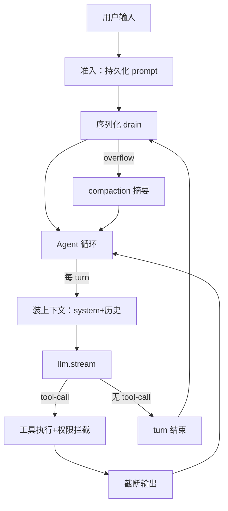

[01](./01-agent-loop)–[07](./07-http-contract) 拆完了零件。这一篇把它们拼起来，给你一份「自建 coding agent」的取舍清单：**什么是底线、什么可以先省、按什么顺序搭**。

## 拼起来的样子

一个最小可用的 coding agent，运行时是这样的：

数据流：用户输入 → 持久化 → 串行 drain → agent 循环（装上下文 → stream → 工具 → 喂回）→ 直到模型不调工具 → drain 消化下一条。

## 底线（不做就不能用）

这些是「agent 能跑起来」的硬性要求，再省也不能省：

1. **Agent 循环**（[01](./01-agent-loop)）：两层 while——inner 跑到模型不调工具，outer 处理新排队。每 turn 一次 stream，工具结果喂回下一 turn。
2. **`needsContinuation` 判定**：turn 内有 tool-call 就继续，否则停。这是循环的退出条件。
3. **步数上限**：哪怕硬编码 max steps，也要有刹车——否则模型可能无限调工具。
4. **统一工具接口 + 参数校验**（[04](./04-tool-system)）：`{ id, description, parameters(schema), execute }`。别每个工具硬编码。
5. **危险操作拦截**：shell/write/delete 执行前要能弹确认。最小版「全 ask」也行，不能没有。
6. **输出截断**：工具输出超长就截。不做的话一次 `grep` 就 context 爆炸。
7. **给输出留 token 空间**（[03](./03-context-management)）：`context - max(output, buffer)`。发请求前估算并截断历史，否则模型连回复都吐不出。
8. **统一 stream 事件**（[05](./05-multi-provider)）：把 SDK 原生事件转成自己的统一 event 类型。哪怕只接一家，也别让 runner 直接吃 SDK 事件。
9. **流式超时**：至少一个 stream chunk timeout，别让 hang 拖死 session。

## 推荐先省（最小版用简化方案）

这些 opencode 做到了生产级，但最小版可以用更简单的等价物：

| opencode 的 | 最小版替代 | 代价 |
|---|---|---|
| 准入/执行分离 + 序列化 drain（[02](./02-session-state)） | 内存串行处理单 prompt | 进程崩丢消息、不能插队 |
| steer/queue 投递 | FIFO 串行 | 用户不能中途插话 |
| System Context 代数 + Context Epoch（[03](./03-context-management)） | 静态 system prompt 全量重建 | 不能动态环境、每 turn 重算 |
| compaction 摘要 + overflow 自愈 | 硬截断历史 + overflow 直接报错 | 丢上下文、长对话会断 |
| 30+ provider 注册表 + auth catalog 合并（[05](./05-multi-provider)） | 单家 + env key | 不能换厂商 |
| tree-sitter shell 静态分析（[04](./04-tool-system)） | 全量 ask 用户 | 打扰多 |
| task 子 agent | 单 agent | 大任务撑爆 context |
| MCP + Skill（[06](./06-mcp-skills)） | 内置工具够用 | 不能扩展外部能力 |
| 类型化 HttpApi 契约 + codegen + 多端（[07](./07-http-contract)） | 进程内函数调用 | 不能多端 |
| 权限规则引擎 + always 级联 | 全 ask | 体验差但安全 |
| git-based snapshot + revert | 不做 | 不能回退 session |

## 推荐搭建顺序

照这个顺序，每步都能跑、能测：

1. **跑通单 turn**：硬编码 system + 一条用户消息 → 调一家 LLM SDK → 打印响应。先证明能跟模型对话。
2. **加工具循环**：定义统一 Tool 接口，实现 read + bash 两个工具。加 `needsContinuation` + max steps。现在它能调工具了。
3. **加权限 + 截断**：危险工具 ask、输出截断。现在它安全了。
4. **加多 turn 历史**：把消息历史累积起来喂回。现在它能对话了。
5. **加持久化**：准入/执行分离、prompt 落库、崩溃恢复。现在它可靠了。
6. **加上下文管理**：硬截断 → 升级到 compaction。现在它能撑长对话了。
7. **加多 provider**：抽 route + 统一 stream。现在它能换模型了。
8. **(可选) 加 MCP/Skill**：现在它能扩展了。
9. **(可选) 加多端**：抽 HTTP 契约。现在它是产品了。

每一步都建立在前一步「能跑」的基础上，不会推倒重来。

## opencode 做了但你不一定要做的（生产级取舍）

这些是 opencode 作为**生产级开源产品**的选择，自用 agent 不必照搬：

- **Effect 4.0 全栈**：opencode 用 Effect 的 Service/Layer/Schema/Stream 做依赖注入和错误处理。这是强工程约束，学习曲线陡。自建可以用更主流的栈（Python + pydantic、Node + zod）。收益是结构化，代价是复杂。
- **Session V2 事件溯源**：所有状态变更走事件 + projector。强大但重。自建可以先用直接 DB 写。
- **多 worktree + 多 project 路由**：opencode 一个 server 管多个项目。自用单项目不用。
- **LSP 集成**：opencode 内置 LSP 客户端给 agent 拿 hover/定义/引用。自建可以先用 grep/glob 代替。
- **Snapshot git-dir**：独立 git 仓库存快照。复杂但能精确 revert。自建可以先不做 revert。
- **IDE 扩展自动安装**：产品化功能。自建跳过。

## 一句话总结

opencode 的工程量在「**可靠性**」（不丢、不爆、可续、可恢复）和「**可扩展性**」（多 provider、多端、MCP、插件）上。一个能自用的最小 agent，抓住**循环 + 工具 + 权限 + 截断 + 超时**这五条底线，其余都可以迭代加。先让它能跑，再让它可靠，最后才让它可扩展——别一上来就抄 opencode 的全套架构。

> 这条 build-your-own 线到此结束。回到 [导读](./introduction) 重看全局，或钻进参考线（[功能](../features/cli-commands)、[实现原理](../internals/dependency-layering)）深挖具体子系统。
