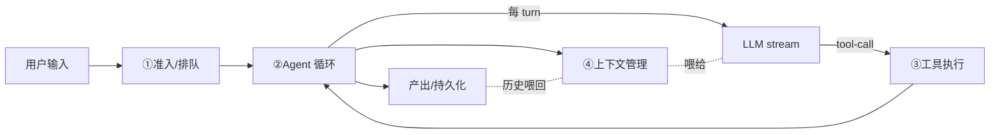

「参考线」（`features/`、`internals/`）回答的是「opencode 这块代码长什么样」；这条「build-your-own」线回答的是**「如果我自己造一个，每一步该怎么设计、为什么这么设计、能砍掉什么」**。目标读者：想做一个自己的 AI coding agent（或类似 LLM agent 产品）的人。

## 一个 coding agent 的最小零件

把 opencode 这套庞杂的工程剥到骨头，一个能用的 coding agent 其实只有五个零件：

1. **Agent 循环**：一次 `llm.stream` 一个 turn，turn 内执行工具，工具结果喂回去，直到模型不再调工具。这是 agent 的心跳。
2. **会话状态**：用户输入要持久化、要能排队/插队、runner 崩了不能丢消息。这是 agent 的可靠性。
3. **上下文管理**：历史会越来越长，要做 system context 注入、compaction（摘要压缩）、context epoch（基线+增量）。这是 agent 不爆炸的前提。
4. **工具系统**：工具统一注册、参数校验、输出截断、权限拦截。这是 agent 能干活的手。
5. **多 provider + 多端**：抽象掉 LLM 厂商差异；契约驱动地同时支撑 CLI/TUI/Web/SDK。这是 agent 能落地成产品。

opencode 把这五个零件都做到了「生产级」。这条线逐个拆开，每个都给你：**opencode 怎么做 → 设计取舍 → 你自建时的最小子集**。

## 阅读顺序

1. **[01 · Agent 循环](./01-agent-loop)** — 最小 provider-turn 循环：stream + 工具 settle + needsContinuation。从 `runner/llm.ts` 抽可复刻骨架。
2. **[02 · 会话状态](./02-session-state)** — 持久化会话：准入/执行分离 + 序列化 drain + steer/queue。为什么不内存 tool loop。
3. **[03 · 上下文管理](./03-context-management)** — System Context 代数 + compaction + Context Epoch。防上下文爆炸的工程化方案。
4. **[04 · 工具系统](./04-tool-system)** — 工具注册 / schema 校验 / 截断 / 权限统一拦截。含 shell 静态分析取舍。
5. **[05 · 多 Provider](./05-multi-provider)** — Provider 抽象 + auth/catalog 合并 + 单 stream 契约。
6. **[06 · MCP 与 Skill](./06-mcp-skills)** — 外部能力接入：MCP 传输/OAuth + skill 发现/注入。
7. **[07 · HTTP 契约驱动多端](./07-http-contract)** — HttpApi → codegen → CLI/TUI/web/desktop/SDK/embedded。
8. **[08 · 总装与取舍清单](./08-putting-together)** — 把零件拼起来，哪些能砍、哪些是底线，自建项目的最小子集建议。

建议按顺序读：01–02 是心脏，03–05 是关键工程化，06–07 是扩展与落地，08 是总装。

## 约定

- 引用 opencode 源码一律 `packages/.../x.ts:行号`，相对 opencode 仓库根（`v1.17.13` 前后状态；上游重构后行号会漂移）。
- 术语用 opencode 的规范词（见 [术语表](../glossary)）：**Provider Turn**、**Admitted Prompt**、**Session Drain**、**Context Epoch**、**System Context** 等，不用「系统提示词」这类口语说法。
- 每篇结尾有「自建最小子集」小节，告诉你这个零件最少要做到什么程度。

> 这条线不替代参考线——遇到需要深挖某块代码时，会链接到对应的 `internals/` 篇。先读这条线建全局观，再按需钻参考线。
