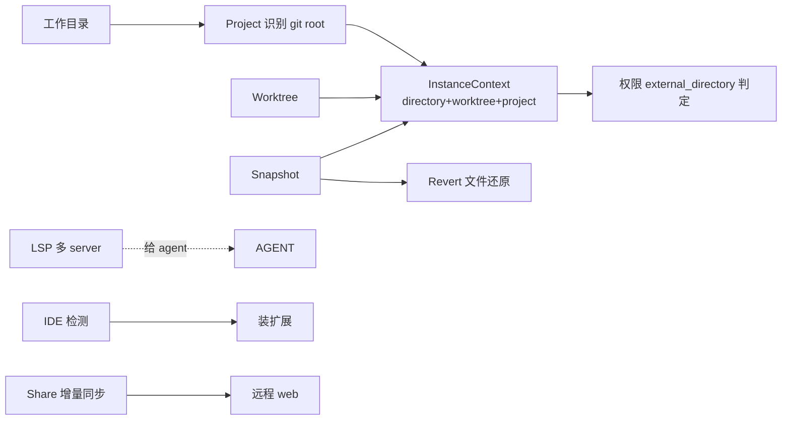

opencode 围绕「项目」组织一切——project 决定目录、worktree 提供隔离、share 支持协作、LSP 给 agent 代码智能、IDE 集成让用户在自己编辑器里用。这几个子系统相对独立，都挂在 project 概念下。

## Project：项目识别

`Project` 服务（`packages/opencode/src/project/project.ts:102`，`@opencode/Project`）。

- `fromDirectory`（`project.ts:213`）：从目录解析出 project，经 `ProjectV2.resolve`（`project.ts:216`，在 core 包）upsert 到 DB。
- 识别方式：git root hash——向上找 `.git`，把 repo 根的哈希作为 project id。同一 repo 的不同子目录算同一个 project。
- DB 表 `ProjectTable`（见 [存储](./storage-db)）。

### InstanceContext

`InstanceContext`（`packages/opencode/src/project/instance-context.ts:5`）是当前操作的「位置三件组」：

```ts
export interface InstanceContext {
  directory: string   // 当前工作目录
  worktree: string    // worktree 根
  project: Project.Info
}
```

`containsPath(filepath, ctx)`（`instance-context.ts:18`）：判断路径是否在 project 边界内——`directory` 或 `worktree` 之内为 true。worktree 是 `/` 时跳过（避免匹配一切）。这是 [权限](./tool-registry-permissions) `external_directory` 判定的几何基础。

## Worktree

`Worktree` 服务（`packages/opencode/src/worktree/index.ts:128`，`@opencode/Worktree`）。

- 存储路径：`Global.Path.data/worktree/{projectID}/`（`worktree/index.ts:208`）。
- `create`（`worktree/index.ts:289`）：建一个隔离工作区。name + 随机后缀（`Slug.create()`，`:182`）防冲突。
- `remove`（`:388`）：删 worktree。
- `reset`（`:525`）：重置 worktree 到干净状态。

worktree 让 agent 在**不影响主工作区**的情况下做实验性改动——比如 explore agent 在 worktree 里跑、revert 用 snapshot。多个 session 可绑不同 worktree，互不干扰。

## Share：会话分享

`Share` 服务（`packages/opencode/src/share/share-next.ts:81`，`@opencode/ShareNext`）。

- 每个 session 一个**同步队列**（`sync`，`share-next.ts:124`）：事件入队，**1 秒延迟**批量 flush（`Effect.delay(1000)`，`:141`）——不是每个事件都立即发，攒一波再传，省请求。
- `flush`（`:247`）：把队列里的数据发到远程 share。
- `create`（`:310`）：建远程 share 后 `full`（`:274`）全量同步当前 session。
- `full`：一次性把整个 session 历史推到远程。

远程端点：legacy `/api/share` 或 console `/api/shares`。分享后用户拿到一个 URL，别人能在 web 上实时看会话进展（增量同步）。

## LSP

`LSP` 服务（`packages/opencode/src/lsp/lsp.ts:136`，`@opencode/LSP`）——给 agent 提供 IDE 级代码智能。

- **多 server per project**（`Interface`，`lsp.ts:119`）：按扩展名路由到不同 language server。
- 能力：

| 方法 | 位置 |
|---|---|
| `hover` | `lsp.ts:377` |
| `definition` | `:388` |
| `references` | `:400` |
| `implementation` | `:413` |
| `workspaceSymbol` | `:433` |
| `prepareCallHierarchy` | `:443` |
| `incomingCalls` / `outgoingCalls` | `:472` / `:476` |
| `diagnostics` | `:364` |
| `touchFile` | `:344` |

- `touchFile`（`:344`）：打开/预热一个文件——让 LSP server 解析它，拿诊断信息。agent 在编辑前 touchFile 拿诊断，编辑后拿新诊断验证。

LSP 让 agent 不只靠 `grep`/`glob`——能拿精确的类型信息、定义跳转、引用查找。

## IDE 检测与扩展安装

`packages/opencode/src/ide/index.ts`：

- `SUPPORTED_IDES`（`ide/index.ts:6`）：Windsurf / VSCode-Insiders / VSCode / Cursor / VSCodium。
- `ide()`（`:22`）：检测当前 IDE——看 `TERM_PROGRAM === "vscode"`（`:23`）+ `GIT_ASKPASS` 包含哪个 IDE 名（`:24-26`）。
- `install(ide)`（`:36`）：跑 `{cmd} --install-extension sst-dev.opencode`（`:40`）——给检测到的 IDE 装 opencode 扩展。

检测到 IDE 后，opencode 能在 IDE 里内嵌显示（而不是开独立 TUI 窗口），扩展提供编辑器内的 agent 面板。

## 几个子系统的协作



- **Project/InstanceContext** 是地基——权限、工具作用域、snapshot 都基于它。
- **Worktree + Snapshot** 支撑隔离与 revert。
- **LSP** 给 agent 代码智能（独立于 project 几何）。
- **IDE** 是入口集成。
- **Share** 是协作出口。

它们都通过 `Location` 中间件（见 [HttpApi 与 codegen](./httpapi-codegen)）的 `x-opencode-directory` / `x-opencode-workspace` header 被 per-request 解析——一个 opencode server 能同时管多个 project/worktree。
