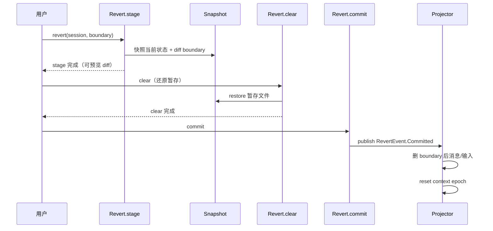

opencode 的 session 能「回退到某一步」、每步能展示「改了哪些文件」，靠的是一套**基于 git 的快照机制**。`Snapshot` 服务（`packages/opencode/src/snapshot/index.ts:47`，`@opencode/Snapshot`）在主 repo 之外维护独立 git 仓库存快照，session revert 三阶段（`revert.ts`）消费它。

## 为什么不直接用主 repo？

主 repo 是用户的——可能 dirty、可能没 git、可能分支不对。opencode 不该污染它。所以 snapshot 用**独立 git-dir**，按 project + worktree 隔离：

```ts
// snapshot/index.ts:71
gitdir: path.join(Global.Path.data, "snapshot", ctx.project.id, Hash.fast(ctx.worktree))
```

- 路径：`Global.Path.data/snapshot/{projectID}/{worktree_hash}`。
- 每个 project 的每个 worktree 一份独立 git 仓库。
- `seed`（`snapshot/index.ts:198`）：从主 repo 拷贝 objects（git alternates 机制）——快照仓库不重复存主 repo 已有的对象，省空间。

## track：写快照

`track`（`snapshot/index.ts:318`）对一个时间点的文件状态建快照：

1. `git init`（若 snapshot 仓库不存在）+ seed alternates。
2. `git add` 当前文件（受 gitignore 忽略，`ignore` 函数 `:102`）。
3. `git write-tree` → 得到一个 tree hash，就是这次快照的指针。

> 不创建 commit、不动 HEAD——只存 tree object。轻量。

### 大文件跳过

`limit = 2 * 1024 * 1024`（`snapshot/index.ts:24`，2MB）：超过的文件跳过（`:277` 的 `large` 集合）。避免快照库膨胀。session diff 对这些大文件只显示「已变更」不存内容。

## diff：展示改动

`diffFull`（`snapshot/index.ts:546`）算两个快照间的文件 diff，用 `git cat-file --batch`（`:605`）批量取对象内容，高效。

session 每步结束发的 `Step.Ended` 事件里带的文件 diff（见 [一次 Provider Turn](./llm-stream-loop)）就来自 snapshot diff——`startSnapshot` → `endSnapshot` 两个 tree 的 diff。

## 清理

`prune = "7.days"`（`snapshot/index.ts:23`）：snapshot 仓库定期 `git gc --prune=7.days`（`:305`）清理 7 天前的悬空对象。

## Session Revert 三阶段

`SessionRevert`（`packages/core/src/session/revert.ts`）用 snapshot 实现「回退到某步」。三个阶段：



- **`stage`**（`revert.ts:60`）：快照当前状态 + 计算 boundary 的 diff——给用户**预览**「回退会丢什么」。**这一步不改任何东西**，可安全调用。
- **`clear`**（`revert.ts:98`）：还原暂存的文件状态——把工作区文件回退到 boundary 那一刻。
- **`commit`**（`revert.ts:113`）：发布 `RevertEvent.Committed` 事件，真正的状态删除在 projector。

### projector 删除

`RevertEvent.Committed` 的 projection（`packages/core/src/session/projector.ts:415`）做实际删除：

- 删 `SessionMessageTable` 中 `seq > boundary.seq` 的消息（`projector.ts:429`）。
- 删 `SessionInputTable` 中 `admitted_seq`/`promoted_seq` 超过 boundary 的输入（`projector.ts:437`）。
- `SessionContextEpoch.reset`（`projector.ts:452`）——下个 turn 重新 `initialize` 基线。

> 为什么分三阶段？因为 revert 是危险操作。stage 让用户先看 diff 确认，clear 做文件还原，commit 才真正删历史。用户可以在 stage 后取消。这也是为什么 `commit` 单独存在——文件已经 clear 了，但消息历史还在，commit 才把它们删掉。

## 与 compaction 的区别

- **compaction**（见 [System Context 代数](./system-context-algebra)）：摘要旧历史，**减少** token，不丢「发生过的事」（摘要保留了要点）。
- **revert**：**删掉** boundary 之后的历史，像没发生过。

compaction 是「压缩」，revert 是「撤销」。snapshot 同时支撑两者——compaction 不用 snapshot（它改的是消息列表），revert 用 snapshot 还原文件。
