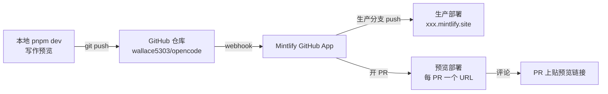

[本地开发](./tooling) 用 `pnpm dev` 预览，但要让别人能看到、让每个 PR 有预览链接，得把站点发布出去。Mintlify 通过 **GitHub App** 把文档站和代码仓库关联起来：push 自动部署、PR 自动出预览。这篇是操作步骤。

> 本仓库已托管在 [github.com/wallace5303/opencode](https://github.com/wallace5303/opencode)。下面以它为例。

## 前提

- 仓库已推到 GitHub（本仓库：`wallace5303/opencode`）。
- `website/docs.json` 在默认分支（`dev`）上配置正确（`pnpm lint` 通过、`pnpm build` 能过）。
- 有 mintlify.com 账号（用 GitHub 登录）。

## 工作机制



- **生产部署**：push 到生产分支 → 自动构建发布。
- **预览部署**：开 PR → 自动生成独立预览 URL，贴回 PR 评论，合并前可看渲染效果。
- 本地 `pnpm dev` 仍用于写作时的实时预览，和线上部署互不影响。

## 步骤

### 1. 在 mintlify.com 创建项目

打开 [mintlify.com/start](https://mintlify.com/start)，用 GitHub 登录，走 onboarding：

- 选 **Connect to GitHub**。
- 选或创建仓库 → 选 `wallace5303/opencode`（本 docs 仓库）。
- 安装 **Mintlify GitHub App**，授权访问该仓库。

> GitHub App 是关联的关键：它给仓库装 webhook，push/PR 时通知 Mintlify 触发部署。没装 App 就不会自动部署。

### 2. 配置 Git 来源

在 Mintlify dashboard 的 **Git Settings** 里：

- **Repository**：`wallace5303/opencode`（确认选中）。
- **Production branch**：`dev`（本仓库默认分支）。
- **Root directory**：`website`（`docs.json` 在 `website/` 下，不是仓库根）。

> ⚠️ Root directory 必须填 `website`。Mintlify 以 `docs.json` 所在目录为项目根——和本地 `pnpm dev` 必须在 `website/` 跑是同一个道理。

### 3. 启用 PR 预览

在 dashboard 的 **Deployments / Preview** 设置里，确保 **Preview deployments on pull requests** 打开。开后，每个 PR 会自动出一个预览 URL。

### 4. 触发首次部署

两种方式：

- **自动**：往 `dev` push 一个改动（哪怕只改 README），GitHub App 收到 webhook → 自动构建。
- **手动**：dashboard 里点 **Deploy** / **Redeploy** 立即触发。

部署完成后拿到 `https://<your-project>.mintlify.site` 形式的生产地址。

### 5. 验证 PR 预览

```bash
git checkout -b docs/test-preview
# 改一篇 .mdx
git commit -am "docs: test preview deploy"
git push origin docs/test-preview
# 去 GitHub 开 PR
```

PR 开出后 1–2 分钟，Mintlify bot 会在 PR 评论里贴预览链接（形如 `https://<project>-pr-<n>.mintlify.site`）。点开看渲染效果，确认无误再合并。

## 用 API 触发预览（CI/脚本）

除了 PR 自动触发，也能用 Mintlify API 主动触发某分支的预览部署：

```bash
curl -X POST https://www.mintlify.com/api/project/preview/<projectId> \
  -H "Authorization: Bearer <MINTLIFY_API_KEY>" \
  -H "Content-Type: application/json" \
  -d '{"branch":"docs/test-preview","commitSha":"<可选>"}'
# → { "statusId": "deployment_status_id_123" }
```

- `projectId` 在 dashboard 项目设置里拿。
- `branch` 必填；`commitSha` 可选（不给就用该分支最新 commit）。
- 返回 `statusId`，可拿去查部署进度。

适合在脚本/CI 里「改完文档主动出预览」的场景。

## 自定义域名（可选）

dashboard → **Domains** 加自己的域名（如 `docs.yourdomain.com`），按提示加 DNS 记录。Mintlify 会签 TLS 证书。之后生产地址用自定义域名，`.mintlify.site` 仍可作为兜底。

## 本地 vs 线上

| 场景 | 用什么 |
|---|---|
| 写作时实时预览 | 本地 `pnpm dev`（端口 3011） |
| 写完发 PR 让人审阅 | PR 预览部署（自动） |
| 正式发布给读者 | 生产部署（合并到 `dev` 自动触发） |
| 失效链接检查 | 本地 `pnpm lint` + dashboard 也会检查 |

> 写作流程推荐：本地 `pnpm dev` 边写边看 → `pnpm lint` 过 → 提 PR → 预览链接最终确认 → 合并到 `dev` 自动上线。

## 故障排查

- **push 后没部署**：先检查 GitHub App 是否装好（GitHub → Settings → Integrations → Applications → Mintlify），且授权了 `wallace5303/opencode`。App 装好但仍不部署 → dashboard 手动 **Redeploy**。
- **预览 PR 没出链接**：确认 PR 目标分支是生产分支（`dev`），且 Preview deployments 已开启。bot 评论可能在 1–2 分钟后才出现。
- **部署报错 `docs.json not found`**：Git Settings 的 Root directory 没填 `website`。
- **页面 404 / 链接失效**：本地先 `pnpm lint`，修掉 broken links 再 push。dashboard 部署日志也会列失效链接。
- **改了 `docs.json` 导航没生效**：`docs.json` 改动要 push 才触发重新构建；本地 `pnpm dev` 重启可见。

## 进一步阅读

- 本地起站与命令：[工程基建](./tooling)
- 调试源码：[调试源码](./debugging)
- opencode 上游「agent 给自己写文档」的闭环：[文档站](./features/docs-site)
